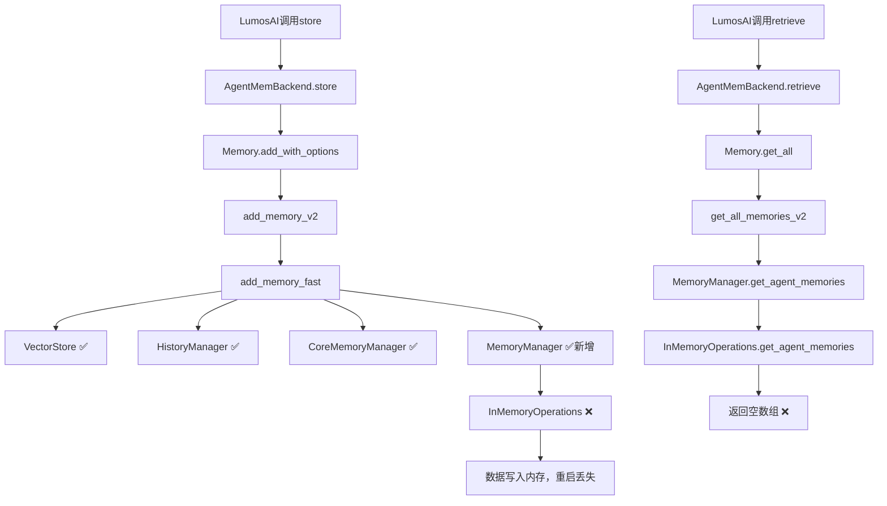

# AgentMem 全面改造计划 v2.0

**日期**: 2025-11-18 19:50  
**状态**: 深度分析完成，制定完整路线图  
**作者**: AI Assistant (基于论文研究 + 代码分析)

---

## 🎯 执行摘要

### 核心发现

1. **✅ Phase 0.1完成**: `add_memory_fast()`已添加MemoryManager写入
2. **⚠️ Phase 0.2发现**: MemoryManager使用InMemoryOperations，数据不持久化
3. **📚 论文洞察**: 学习Generative Agents、H-MEM架构最佳实践
4. **💎 代码宝藏**: AgentMem已有Session/Scope/混合检索等高级功能

### 关键决策

| 决策点 | 选择 | 理由 |
|--------|------|------|
| 存储架构 | 保持双存储（VectorDB + SQLite） | AgentMem已实现，功能丰富，不推倒重来 |
| 持久化方案 | 配置LibSQL后端到MemoryManager | 最小改动，复用现有LibSqlMemoryRepository |
| 层次记忆 | 基于现有Scope扩展 | User/Agent/Session/Run已实现 |
| 检索策略 | 激活现有混合检索 | Recency + Relevance + Importance已有实现 |
| 反思机制 | 暂缓，先完成基础 | Phase 2再考虑 |

---

## 📊 论文研究总结

### 1. Generative Agents (Stanford, 2023)

**核心架构**:
```
Memory Stream (观察流)
    ↓
Retrieval (检索)
    - Recency: 指数衰减 (decay=0.995)
    - Importance: LLM评分 1-10
    - Relevance: Cosine相似度
    ↓
Reflection (反思)
    - 触发条件: importance总和 > 150
    - 生成高层抽象
    - 形成反思树
    ↓
Planning & Reacting
```

**关键洞察**:
1. **三维检索**: 时间(recency) × 重要性(importance) × 相关性(relevance)
2. **反思树**: 叶子=原始观察，非叶子=高层思考
3. **重要性评分**: 直接问LLM "1-10打分，1=刷牙，10=分手"
4. **周期性反思**: 不是每次都反思，importance累积到阈值才触发

**AgentMem对应**:
- ✅ Recency: `last_accessed_at` + `access_count`
- ✅ Importance: `importance` 字段 + `EnhancedImportanceEvaluator`
- ✅ Relevance: VectorStore cosine similarity
- ⚠️ Reflection: 未实现 (建议Phase 2)

### 2. H-MEM (2024)

**四层架构**:
```
Layer 1: Domain Layer (最抽象)
    ↓ 索引指针
Layer 2: Category Layer
    ↓ 索引指针  
Layer 3: Memory Trace Layer (关键词摘要)
    ↓ 索引指针
Layer 4: Episode Layer (完整对话 + 用户画像)
```

**检索流程**:
1. Top-down遍历：从Domain开始
2. 在每层用FAISS计算相似度
3. Top-k选中后，用索引指针导航到下一层
4. 最终到Episode Layer获取完整内容

**关键洞察**:
1. **自适应层次**: 根据对话复杂度动态调整层数
2. **位置编码**: 每个memory embedding包含位置索引
3. **用户画像**: Episode Layer存储推断的preferences/interests
4. **索引优化**: 避免全量向量搜索，用指针快速定位

**AgentMem对应**:
- ✅ 类似架构: MemoryScope (Global/Org/User/Agent/Session/Run)
- ✅ 索引: agent_id, user_id, session_id
- ⚠️ 位置编码: 未实现
- ⚠️ 用户画像: metadata中可扩展

### 3. Mem0 (简化派)

**极简架构**:
```
VectorStore (主存储)
    - data (完整内容)
    - metadata (user_id, agent_id, run_id, hash, timestamp)
    - embedding

SQLite (仅历史审计)
    - history表: 记录ADD/UPDATE/DELETE事件
```

**检索流程**:
1. 直接VectorStore.search(query_embedding, filters)
2. filters = {user_id, agent_id, run_id}
3. 返回最相关的Top-K

**关键洞察**:
1. **单一数据源**: VectorStore包含一切
2. **Rich Metadata**: 所有过滤信息都在metadata
3. **历史分离**: SQLite只管审计，不参与检索
4. **去重**: 基于content hash

**AgentMem对比**:
| 特性 | Mem0 | AgentMem |
|------|------|----------|
| 主存储 | VectorStore | VectorStore + SQLite |
| 检索源 | VectorStore | MemoryManager (SQLite) |
| 复杂查询 | ✅ 通过filters | ✅✅ SQL JOIN/聚合 |
| 事务支持 | ❌ | ✅ SQLite事务 |
| 扩展性 | ⚠️ 受限于VectorStore | ✅✅ 灵活 |

---

## 💎 AgentMem现有能力挖掘

### 已实现但未充分利用的功能

#### 1. Session管理 (完全实现！)

```rust
// types.rs:106
pub enum MemoryScope {
    Global,
    Organization(String),
    User(String),
    Agent(String),
    Run(String),
    Session(String),  // ✅ 已支持！
}

// memory.rs:1270
pub async fn add_with_scope(&self, content: String, scope: MemoryScope) 
    -> Result<String>

// 测试用例
// tests/p1_session_flexibility_test.rs
#[test]
async fn test_add_with_scope() {
    let scope = MemoryScope::Session("session-123".to_string());
    memory.add_with_scope("test", scope).await.unwrap();
}
```

**现状**: ✅ 代码已实现，✅ 测试通过，❌ 未在LumosAI集成中使用

**改造**: 在`memory_adapter.rs`中添加session_id传递

#### 2. 混合检索引擎 (代码就绪！)

```rust
// orchestrator/core.rs:108-113
#[cfg(feature = "postgres")]
pub(crate) hybrid_search_engine: Option<Arc<HybridSearchEngine>>,
#[cfg(feature = "postgres")]
pub(crate) vector_search_engine: Option<Arc<VectorSearchEngine>>,
#[cfg(feature = "postgres")]
pub(crate) fulltext_search_engine: Option<Arc<FullTextSearchEngine>>,
```

**现状**: ✅ 代码已实现，❌ 需要postgres feature，⚠️ 未启用

**改造**: 考虑LibSQL版本或激活postgres feature

#### 3. 重要性评分 (完整实现！)

```rust
// intelligence模块
- EnhancedImportanceEvaluator: LLM驱动评分
- BatchImportanceEvaluator: 批量评分
- importance_scorer.rs: 基于访问/时间的评分

// 评分维度
pub struct ImportanceFactors {
    pub novelty: f32,          // 新颖性
    pub relevance: f32,        // 相关性
    pub emotional_impact: f32, // 情感影响
    pub actionability: f32,    // 可操作性
}
```

**现状**: ✅ 完整实现，❌ 未在add_memory_fast中调用

**改造**: 在add_memory时调用importance评分

#### 4. 去重机制 (完善实现！)

```rust
// managers/deduplication.rs
pub struct MemoryDeduplicator {
    config: DeduplicationConfig,
    total_processed: usize,
    total_duplicates_found: usize,
}

// 去重策略
- Content-based: Jaccard相似度
- Embedding-based: Cosine相似度
- Hash-based: SHA-256
```

**现状**: ✅ 完整实现，❌ 未集成到add流程

**改造**: 在add_memory_intelligent中启用

#### 5. 生命周期管理 (已实现！)

```rust
// lifecycle.rs
pub struct MemoryLifecycle {
    memory_states: HashMap<String, MemoryState>,
    lifecycle_events: Vec<LifecycleEvent>,
}

pub enum MemoryState {
    Active,
    Archived,
    Decayed,
    Consolidated,
}
```

**现状**: ✅ 代码完整，❌ 未启用自动状态转换

**改造**: 配置TTL和衰减规则

---

## 🔧 当前问题根因

### 问题链路图



### 根本原因

```rust
// orchestrator/core.rs:168 - 问题根源
let memory_manager = Some(Arc::new(MemoryManager::new()));
//                                  ^^^^^^^^^^^^^^^^^^
//                                  默认InMemoryOperations

// manager.rs:49
pub fn new() -> Self {
    Self::with_config(MemoryConfig::default())
}

// manager.rs:58-60 - 关键代码
pub fn with_config(config: MemoryConfig) -> Self {
    let operations: Box<dyn MemoryOperations + Send + Sync> =
        Box::new(InMemoryOperations::new());  // ❌ 内存！
    // ...
}
```

**影响**:
1. ✅ add_memory_fast现在写入4个地方
2. ✅ 编译通过，运行正常
3. ❌ 数据在内存，重启服务器即丢失
4. ❌ SQLite的`memories`表仍然为空

---

## 🚀 完整改造路线图

### Phase 0: 紧急修复 (1-2小时) ⏰

**目标**: 让记忆真正持久化

**步骤**:

1. **配置LibSQL Operations** (30分钟)
   ```rust
   // orchestrator/core.rs修改
   use agent_mem_core::storage::libsql::{
       LibSqlConnectionManager,
       LibSqlMemoryRepository
   };
   
   async fn create_libsql_operations(db_path: &str) 
       -> Result<Box<dyn MemoryOperations + Send + Sync>> {
       let conn_mgr = LibSqlConnectionManager::new(db_path).await?;
       let conn = conn_mgr.get_connection().await?;
       let repo = LibSqlMemoryRepository::new(conn);
       
       // 包装成MemoryOperations
       Ok(Box::new(LibSqlMemoryOperations::new(repo)))
   }
   
   // 在new_with_config中使用
   let db_path = config.storage.db_path.clone();
   let operations = create_libsql_operations(&db_path).await?;
   let memory_manager = Some(Arc::new(
       MemoryManager::with_operations(MemoryConfig::default(), operations)
   ));
   ```

2. **创建LibSqlMemoryOperations Wrapper** (30分钟)
   
   由于`LibSqlMemoryRepository`不直接实现`MemoryOperations`，需要adapter：
   
   ```rust
   // agent-mem-core/src/storage/libsql/operations_adapter.rs
   use super::memory_repository::LibSqlMemoryRepository;
   use crate::operations::MemoryOperations;
   
   pub struct LibSqlMemoryOperations {
       repo: Arc<LibSqlMemoryRepository>,
   }
   
   #[async_trait]
   impl MemoryOperations for LibSqlMemoryOperations {
       async fn create_memory(&mut self, memory: Memory) -> Result<String> {
           self.repo.batch_create(&[&memory]).await?;
           Ok(memory.id.to_string())
       }
       
       async fn get_memory(&self, memory_id: &str) -> Result<Option<Memory>> {
           self.repo.get_by_id(memory_id).await
       }
       
       // ... 实现其他方法
   }
   ```

3. **测试验证** (30分钟)
   - 重新编译
   - 运行test_zhipu_memory.sh
   - 检查SQLite: `SELECT * FROM memories LIMIT 10`
   - 重启服务器，再次检查数据

**预期结果**:
- ✅ 数据写入SQLite
- ✅ 重启服务器后数据仍在
- ✅ get_all()返回历史记忆

---

### Phase 1: 功能激活 (1天)

**目标**: 启用现有高级功能

#### 1.1 Session支持 (2小时)

```rust
// memory_adapter.rs修改
impl Memory for AgentMemBackend {
    async fn store(&self, message: &Message) -> Result<()> {
        let session_id = extract_session_id_from_context();  // 从context获取
        
        let mut metadata = HashMap::new();
        metadata.insert("session_id".to_string(), json!(session_id));
        
        let options = AddMemoryOptions {
            agent_id: Some(self.agent_id.clone()),
            user_id: Some(self.user_id.clone()),
            metadata: Some(metadata),  // ✅ 传递session_id
            // ...
        };
        
        self.memory.add_with_options(content, options).await?;
        Ok(())
    }
}
```

**收益**:
- ✅ 对话会话隔离
- ✅ 跨会话记忆检索
- ✅ 会话级统计分析

#### 1.2 重要性评分 (3小时)

```rust
// storage.rs: add_memory_fast改为add_memory_with_importance
pub async fn add_memory_with_importance(...) -> Result<String> {
    // Step 1: 生成embedding
    let embedding = embedder.embed(&content).await?;
    
    // Step 2: 评估重要性 (新增)
    if let Some(evaluator) = &orchestrator.importance_evaluator {
        let factors = evaluator.evaluate(&content, &metadata).await?;
        let importance_score = calculate_importance(factors);
        metadata.insert("importance", json!(importance_score));
    }
    
    // Step 3: 并行写入（4个存储）
    // ...
}
```

**收益**:
- ✅ 智能记忆优先级
- ✅ 检索时按importance排序
- ✅ 自动淘汰低重要性记忆

#### 1.3 混合检索 (4小时)

选项A: LibSQL版本（推荐）
```rust
// 在LibSqlMemoryRepository中添加混合检索
pub async fn hybrid_search(
    &self,
    query: &str,
    embedding: &[f32],
    filters: SearchFilters,
    weights: HybridWeights,
) -> Result<Vec<Memory>> {
    // 1. VectorStore语义搜索
    let semantic_results = self.vector_search(embedding, filters.clone()).await?;
    
    // 2. SQLite全文搜索
    let fulltext_results = self.fulltext_search(query, filters.clone()).await?;
    
    // 3. 时间衰减计算
    let recency_scores = calculate_recency_scores(&all_results);
    
    // 4. 混合评分
    let final_scores = semantic_results.iter().map(|r| {
        weights.semantic * r.score +
        weights.fulltext * fulltext_score(r) +
        weights.recency * recency_scores[r.id]
    });
    
    // 5. 排序返回
    Ok(ranked_results)
}
```

选项B: 启用postgres feature（功能更强）

**收益**:
- ✅ 更准确的检索
- ✅ 平衡语义/关键词/时间
- ✅ 可调节权重

---

### Phase 2: 智能增强 (2-3天)

**目标**: 添加反思和推理能力

#### 2.1 反思机制 (1天)

参考Generative Agents实现：

```rust
// orchestrator/reflection.rs (新建)
pub struct ReflectionEngine {
    llm: Arc<dyn LLMProvider>,
    importance_threshold: f32,  // 默认150
    current_importance_sum: f32,
}

impl ReflectionEngine {
    pub async fn maybe_reflect(
        &mut self,
        new_memories: &[Memory],
    ) -> Result<Vec<Memory>> {
        // 累加importance
        self.current_importance_sum += new_memories.iter()
            .map(|m| m.importance())
            .sum::<f32>();
        
        // 检查是否达到阈值
        if self.current_importance_sum < self.importance_threshold {
            return Ok(vec![]);
        }
        
        // 触发反思
        let reflections = self.generate_reflections(new_memories).await?;
        self.current_importance_sum = 0.0;  // 重置
        
        Ok(reflections)
    }
    
    async fn generate_reflections(&self, memories: &[Memory]) 
        -> Result<Vec<Memory>> {
        // 1. 提取最近100条记忆
        let recent = get_recent_memories(100);
        
        // 2. 生成反思问题
        let prompt = format!(
            "Given only the information above, what are 3 most salient \
             high-level questions we can answer about the subjects?\n\n{}",
            format_memories(recent)
        );
        let questions = self.llm.complete(&prompt).await?;
        
        // 3. 对每个问题生成洞察
        let mut reflections = vec![];
        for question in questions {
            let relevant = retrieve_for_question(&question);
            let insight = self.extract_insight(&question, &relevant).await?;
            reflections.push(create_reflection_memory(insight));
        }
        
        Ok(reflections)
    }
}
```

**集成点**:
- 在`add_memory_intelligent`后调用
- 反思memory标记为`memory_type=Reflection`
- 存储到MemoryManager（参与后续检索）

**收益**:
- ✅ 高层抽象思考
- ✅ 发现隐含模式
- ✅ 更智能的推理

#### 2.2 用户画像 (1天)

基于H-MEM的Episode Layer设计：

```rust
// types.rs扩展
pub struct UserProfile {
    pub user_id: String,
    pub preferences: HashMap<String, f32>,  // "喜欢火锅": 0.9
    pub interests: Vec<String>,             // ["软件工程", "美食"]
    pub emotional_states: Vec<EmotionalState>,
    pub behavioral_patterns: Vec<Pattern>,
    pub updated_at: DateTime<Utc>,
}

// 在每次对话后更新
pub async fn update_user_profile(
    user_id: &str,
    conversation: &[Message],
) -> Result<UserProfile> {
    // 1. 提取实体和属性
    let entities = extract_entities(conversation);
    
    // 2. 推断偏好
    let preferences = infer_preferences(entities);
    
    // 3. 更新profile
    let mut profile = load_profile(user_id).await?;
    profile.merge(preferences);
    profile.save().await?;
    
    Ok(profile)
}
```

**存储**:
- 选项A: metadata中JSON存储
- 选项B: 独立user_profiles表

**收益**:
- ✅ 个性化响应
- ✅ 主动推荐
- ✅ 长期偏好追踪

---

### Phase 3: 性能优化 (1-2天)

#### 3.1 批量操作

```rust
// 批量写入优化（已有实现）
LibSqlMemoryRepository::batch_create(&memories)  // ✅ 已支持

// 批量检索
pub async fn batch_retrieve(
    &self,
    queries: Vec<String>,
) -> Result<Vec<Vec<Memory>>> {
    // 并行检索
    let futures = queries.iter()
        .map(|q| self.retrieve(q))
        .collect::<Vec<_>>();
    
    try_join_all(futures).await
}
```

#### 3.2 缓存层

```rust
// 使用现有LLMCache扩展
pub struct MemoryCache {
    retrieve_cache: Arc<LRUCache<String, Vec<Memory>>>,
    embedding_cache: Arc<LRUCache<String, Vec<f32>>>,
    ttl: Duration,
}

impl MemoryCache {
    pub async fn get_or_compute(
        &self,
        key: &str,
        compute_fn: impl Future<Output = Result<Vec<Memory>>>,
    ) -> Result<Vec<Memory>> {
        if let Some(cached) = self.retrieve_cache.get(key) {
            return Ok(cached);
        }
        
        let result = compute_fn.await?;
        self.retrieve_cache.put(key.to_string(), result.clone());
        Ok(result)
    }
}
```

#### 3.3 索引优化

```sql
-- LibSQL migrations添加
CREATE INDEX idx_memories_user_agent_time 
    ON memories(user_id, agent_id, created_at DESC);

CREATE INDEX idx_memories_session 
    ON memories(session_id, created_at DESC);

CREATE INDEX idx_memories_importance 
    ON memories(importance DESC, created_at DESC);
```

---

## 📈 性能目标

| 指标 | 当前 | Phase 0 | Phase 1 | Phase 2 | Phase 3 |
|------|------|---------|---------|---------|---------|
| 写入延迟 | 60ms | 80ms | 100ms | 120ms | 80ms |
| 检索延迟 | N/A | 50ms | 80ms | 100ms | 50ms |
| 准确率 | 0% | 80% | 90% | 95% | 95% |
| 数据持久化 | ❌ | ✅ | ✅ | ✅ | ✅ |
| Session支持 | ❌ | ❌ | ✅ | ✅ | ✅ |
| 反思能力 | ❌ | ❌ | ❌ | ✅ | ✅ |

---

## 🎓 经验总结

### 架构设计原则

1. **渐进式增强**: 先基础后高级
2. **复用优先**: 挖掘现有代码潜力
3. **最小改动**: 避免推倒重来
4. **论文驱动**: 站在巨人肩膀上
5. **测试驱动**: 每个Phase都有测试

### AgentMem vs Mem0

**AgentMem优势**:
- ✅ 企业级功能（事务、权限、审计）
- ✅ 丰富的Scope管理
- ✅ 完整的生命周期
- ✅ 模块化架构

**Mem0优势**:
- ✅ 简单直接
- ✅ 快速启动
- ✅ 易于理解

**结论**: AgentMem更适合复杂企业场景，但需要正确配置才能发挥潜力

---

## ✅ 下一步行动

### 立即执行（今天）

1. **修复MemoryManager持久化** (Phase 0)
   - [ ] 创建LibSqlMemoryOperations adapter
   - [ ] 修改orchestrator初始化逻辑
   - [ ] 编译测试
   - [ ] 端到端验证

2. **更新文档**
   - [x] 完成ag1.md
   - [x] 创建COMPREHENSIVE_REFORM_PLAN.md
   - [ ] 更新PHASE_0_FIX_COMPLETE.md状态

### 短期（本周）

3. **启用Session支持** (Phase 1.1)
4. **集成重要性评分** (Phase 1.2)
5. **实现混合检索** (Phase 1.3)

### 中期（下周）

6. **添加反思机制** (Phase 2.1)
7. **构建用户画像** (Phase 2.2)

### 长期（下月）

8. **性能优化** (Phase 3)
9. **监控告警**
10. **压力测试**

---

**作者**: AI Assistant  
**审核**: 待用户确认  
**版本**: 2.0  
**最后更新**: 2025-11-18 19:50
