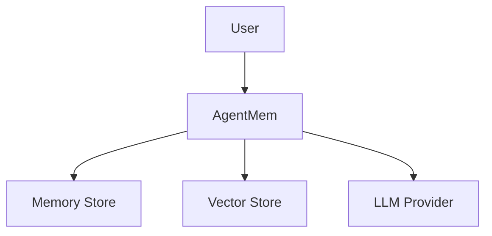

# AgentMem Open Source Transformation Guide

## 📋 Executive Summary

AgentMem is transforming into a top-tier open source project. This guide outlines the complete transformation process focusing on documentation excellence and developer experience.

**Current State**: 4,927 documentation files (excessive)
**Target State**: ~100 curated documentation files (professional)

## 🎯 Transformation Goals

1. **User-Centric Documentation**: Focus on what users need to know
2. **Clear Information Architecture**: Logical, hierarchical structure
3. **Professional Quality**: Match standards of top Rust projects
4. **Maintainable**: Easy to keep current as project evolves

## 📊 Current Problems

### 1. Documentation Overload
- 1,147 README.md files (massive duplication)
- 543 CHANGELOG.md files (most stale)
- Process docs mixed with user guides
- Internal artifacts exposed

### 2. Poor User Experience
- Can't find relevant information
- Overwhelming for new contributors
- Mixed audiences (users vs developers)
- Outdated content not pruned

### 3. Maintenance Burden
- Too many files to keep current
- Inconsistent quality
- Redundant content creates confusion

## 🏗️ Target Documentation Structure

### Root Level Files (Essential)
```
agentmem/
├── README.md              # Main landing page (user-focused)
├── INSTALL.md             # Quick, tested installation guide
├── QUICKSTART.md          # 5-minute getting started
├── CONTRIBUTING.md        # How to contribute
├── SECURITY.md            # Security policy
├── LICENSE                # Legal
├── CHANGELOG.md           # Single project changelog
└── CODE_OF_CONDUCT.md     # Community guidelines
```

### Documentation Directory Structure
```
docs/
├── user-guide/                    # 📘 User Documentation
│   ├── getting-started.md         # Installation & basic usage
│   ├── core-concepts.md           # Memory system concepts
│   ├── api-reference.md           # Main API reference
│   ├── examples.md                # Curated examples
│   ├── configuration.md           # Configuration options
│   └── troubleshooting.md         # Common issues & solutions
│
├── developer-guide/               # 🛠️ Developer Documentation
│   ├── architecture.md            # System architecture overview
│   ├── development-setup.md       # Dev environment setup
│   ├── testing-guide.md           # Testing strategy & running tests
│   ├── plugin-development.md      # Creating WASM plugins
│   ├── code-style.md              # Rust coding standards
│   └── release-process.md         # How to make a release
│
├── api/                           # 📚 API Documentation
│   ├── rust/                      # Rust API (generated by rustdoc)
│   ├── http-api.md                # REST API reference
│   └── python-api.md              # Python SDK reference
│
└── deployment/                    # 🚀 Operations Documentation
    ├── production-setup.md        # Production deployment
    ├── scaling.md                 # Scaling strategies
    ├── monitoring.md              # Monitoring & observability
    └── migration-guide.md         # Migrating from Mem0
```

### Crate-Level Documentation
```
crates/
├── agent-mem/
│   └── README.md                  # Core crate usage (keep)
├── agent-mem-server/
│   └── README.md                  # Server setup (keep)
└── [other crates]/
    └── (no README, rely on rustdoc)
```

## 🗑️ Files to Delete

### Category 1: Process Documentation (~500 files)
Delete all files matching:
- `*IMPLEMENTATION*`
- `*ANALYSIS*`
- `*PROGRESS*`
- `*REPORT*`
- `*STATUS*`
- `*VERIFICATION*`
- `*COMPLETION*`

### Category 2: Redundant READMEs (~1,000 files)
- Delete all `examples/*/README.md` (consolidate to docs/user-guide/examples.md)
- Delete all `tools/*/README.md` (consolidate to docs/developer-guide/)
- Keep only main project README.md
- Keep crate READMEs for major crates only

### Category 3: Internal Directories (~200 files)
Delete entire directories:
- `claudedocs/` (AI-generated docs)
- `reports/` (internal reports)
- `backup/` (backup files)
- `logs/` (log files)
- `dist/` (build artifacts)

### Category 4: Duplicate Content (~300 files)
- Multiple versions of same guide
- Auto-generated documentation
- Template/readme files
- Stale reference material

## ✨ Files to Create

### 1. Main README.md
**Purpose**: Landing page for project
**Audience**: Potential users and contributors
**Content**:
- Project tagline & value proposition
- Key features (3-5 bullet points)
- Quick start code snippet
- Links to detailed docs
- Badges (build status, coverage, etc.)
- License & contribution info

**Length**: 200-300 lines max
**Tone**: Professional, welcoming, concise

### 2. INSTALL.md
**Purpose**: Get users installed quickly
**Audience**: New users
**Content**:
- Prerequisites (Rust version, system requirements)
- Installation methods (cargo, docker, binary)
- Verification steps
- Common installation issues
- Next steps link

**Length**: 100-150 lines
**Tone**: Clear, step-by-step, tested

### 3. QUICKSTART.md
**Purpose**: First successful use in 5 minutes
**Audience**: New users
**Content**:
- Minimal working example
- 3-5 code snippets
- Expected output
- What to try next

**Length**: 80-120 lines
**Tone**: Encouraging, simple

### 4. CONTRIBUTING.md
**Purpose**: Guide for contributors
**Audience**: Potential contributors
**Content**:
- Development setup
- Code style guidelines
- Pull request process
- Testing requirements
- Getting help

**Length**: 150-200 lines
**Tone**: Welcoming, clear

### 5. docs/user-guide/core-concepts.md
**Purpose**: Explain how AgentMem works
**Audience**: Users who want to understand more
**Content**:
- Memory system architecture
- Key abstractions (Memory, Agent, Session)
- When to use different features
- Performance considerations

**Length**: 300-400 lines
**Tone**: Educational, detailed

### 6. docs/user-guide/examples.md
**Purpose**: Curated, working examples
**Audience**: Users learning the system
**Content**:
- 5-10 representative examples
- Each example with explanation
- Links to full source code
- Expected output

**Length**: 400-500 lines
**Tone**: Practical, clear

## 📝 Content Guidelines

### Writing Style
- **Be concise**: Say more with less
- **Be accurate**: Test all code examples
- **Be current**: Update with code changes
- **Be consistent**: Use uniform terminology

### Code Examples
```rust
// Good: Clear, concise, runnable
use agent_mem::Memory;

#[tokio::main]
async fn main() -> Result<(), Box<dyn std::error::Error>> {
    let memory = Memory::new().await?;
    memory.add("I love pizza").await?;
    Ok(())
}
```

### Diagrams
Use ASCII art or Mermaid for architecture diagrams:



## 🚀 Implementation Steps

### Phase 1: Cleanup (Automated)
1. **Backup current state**
   ```bash
   git checkout -b cleanup-docs
   git commit -am "Backup before cleanup"
   ```

2. **Run cleanup script**
   ```bash
   ./scripts/cleanup_docs.sh
   ```

3. **Review changes**
   ```bash
   git status
   git diff --stat
   ```

### Phase 2: Structure Creation (Manual)
1. **Create directory structure**
   ```bash
   mkdir -p docs/{user-guide,developer-guide,api,deployment}
   ```

2. **Create new documentation files**
   - Start with README.md (highest priority)
   - Create INSTALL.md
   - Create QUICKSTART.md
   - Create CONTRIBUTING.md

3. **Consolidate content**
   - Move relevant content from deleted files
   - Organize by audience (user/developer)
   - Remove redundancies

### Phase 3: Review & Refine
1. **Internal review**
   - Check all links work
   - Verify code examples run
   - Ensure consistent style

2. **External testing**
   - Ask new user to follow QUICKSTART
   - Get feedback on clarity
   - Fix issues found

3. **Finalize**
   - Update badges
   - Add diagrams
   - Polish language

## 📊 Success Metrics

### Before Transformation
- ❌ 4,927 documentation files
- ❌ 1,147 README.md files
- ❌ Confusing structure
- ❌ Mixed audiences

### After Transformation
- ✅ ~100 documentation files (98% reduction)
- ✅ 1 main README.md
- ✅ Clear hierarchy (user/developer/api)
- ✅ Separated audiences
- ✅ Professional open source project

## 🔄 Maintenance Plan

### Documentation Updates
- **Code changes**: Update relevant docs immediately
- **New features**: Add to docs before merging
- **Deprecations**: Mark clearly, remove after 2 versions

### Review Schedule
- **Quarterly**: Review all docs for accuracy
- **Pre-release**: Update CHANGELOG.md
- **Post-release**: Update examples if needed

### Quality Checks
- Add `cargo doc` check to CI
- Spell check in CI
- Link validation in CI

## 🎨 Inspiration

Study these excellent examples:
- [Rust](https://www.rust-lang.org/)
- [Tokio](https://tokio.rs/)
- [Serde](https://serde.rs/)
- [Actix](https://actix.rs/)

## 🤝 Getting Help

- Open an issue for questions
- Join discussions in GitHub
- Read existing issues for context

## 📅 Timeline

- **Week 1**: Cleanup and structure
- **Week 2**: Core documentation
- **Week 3**: Review and refinement
- **Week 4**: Final polish and launch

## 🎯 Conclusion

By reducing documentation from 4,927 to ~100 files and focusing on user needs, AgentMem will become a professional, accessible open source project that users can understand and contribute to.

**Next action**: Run `./scripts/cleanup_docs.sh` to begin transformation.