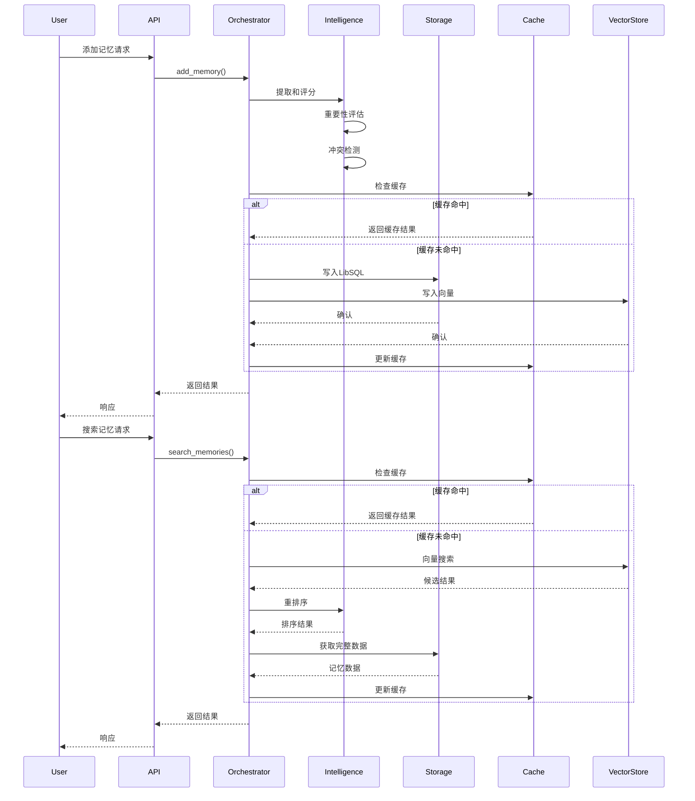
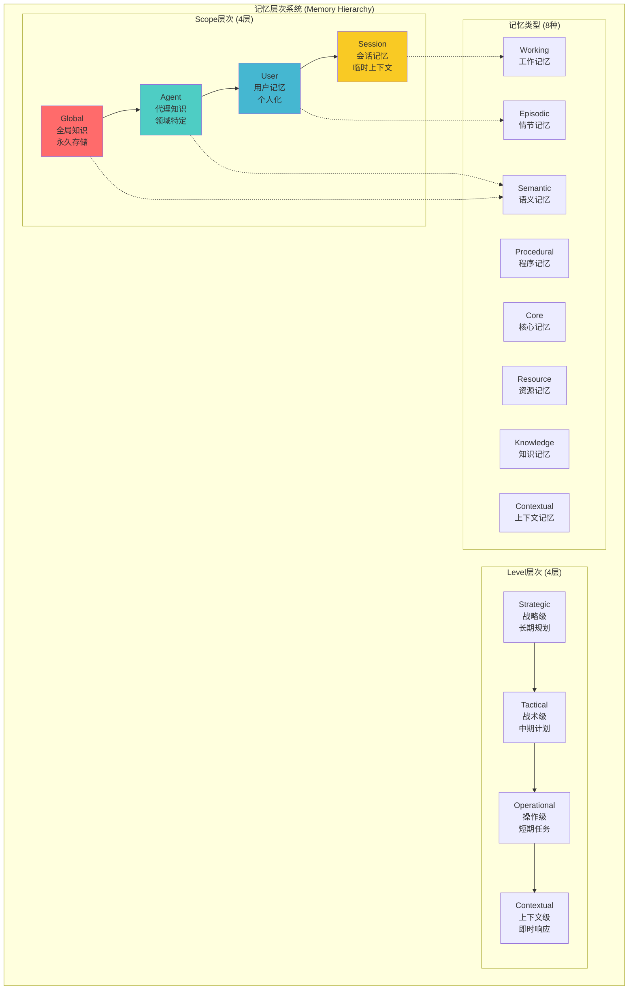

# AgentMem 顶级记忆平台改造计划 v6.0

**分析日期**: 2025-12-10  
**分析范围**: 全面分析记忆系统，对标顶级产品，制定完善改造计划  
**目标**: 构建顶级记忆平台，达到业界领先水平  
**参考标准**: PISA、O-Mem、SHIMI、KARMA、MemoryOS、Mem0、MemOS、Claude Code等2025最新研究

---

## 📋 执行摘要

### 核心目标

基于2025年最新记忆系统研究和对标顶级产品（Mem0、MemOS、Claude Code），全面改造AgentMem，实现：

1. **准确性**: 记忆检索准确率 >95%，支持因果推理和上下文理解
2. **性能**: 批量操作 >10,000 ops/s，延迟P99 <100ms
3. **易用性**: 零配置启动，API简洁直观，文档完善

### 关键发现

| 维度 | 当前状态 | 目标状态 | 差距 |
|------|---------|---------|------|
| **准确性** | ~70% | >95% | 需要因果推理、重排序、上下文理解 |
| **性能** | 473 ops/s | 10,000+ ops/s | 21x提升（批量优化、缓存、并发） |
| **易用性** | 中等 | 顶级 | 需要简化API、完善文档、提供示例 |

---

## 🏗️ 整体架构设计

### 架构全景图（ASCII Art）

```
graph TB
    subgraph "接口层 (Interface Layer)"
        API[REST API<br/>Axum Server]
        MCP[MCP Tools<br/>CLI Interface]
        UI[Web UI<br/>Next.js]
        SDK[SDK & Examples]
    end

    subgraph "编排层 (Orchestration Layer)"
        ORCH[MemoryOrchestrator<br/>统一编排器]
        WM[Working Memory<br/>会话管理]
        TOOL[Tool Executor<br/>工具调用]
    end

    subgraph "智能层 (Intelligence Layer)"
        subgraph "记忆引擎"
            ME[Memory Engine<br/>核心引擎]
            MI[Memory Integration<br/>记忆整合]
            HS[Hierarchical Service<br/>层次服务]
        end
        subgraph "智能推理"
            IE[Intelligence Engine<br/>AI推理引擎]
            EX[Extraction<br/>记忆提取]
            IMP[Importance Scorer<br/>重要性评分]
            CON[Conflict Resolver<br/>冲突处理]
        end
        subgraph "检索系统"
            VS[Vector Search<br/>向量搜索]
            HS2[Hybrid Search<br/>混合搜索]
            RERANK[Reranker<br/>重排序]
            CA[Context Aware<br/>上下文感知]
        end
        LLM[LLM Adapter<br/>20+ Providers]
    end

    subgraph "存储层 (Storage Layer)"
        subgraph "结构化存储"
            SQL[LibSQL Repository<br/>主存储]
            PG[PostgreSQL<br/>可选]
        end
        subgraph "向量存储"
            LANCE[LanceDB<br/>向量索引]
            QDRANT[Qdrant<br/>可选]
            PGVEC[pgvector<br/>可选]
        end
        subgraph "缓存系统"
            L1[L1 Cache<br/>内存LRU]
            L2[L2 Cache<br/>Redis]
        end
        HIST[History Manager<br/>审计日志]
    end

    subgraph "记忆类型 (Memory Types)"
        EPI[Episodic<br/>情节记忆]
        SEM[Semantic<br/>语义记忆]
        PROC[Procedural<br/>程序记忆]
        WORK[Working<br/>工作记忆]
        CORE[Core<br/>核心记忆]
        RES[Resource<br/>资源记忆]
        KNOW[Knowledge<br/>知识记忆]
        CTX[Contextual<br/>上下文记忆]
    end

    subgraph "记忆层次 (Memory Hierarchy)"
        GLOBAL[Global Scope<br/>全局]
        AGENT[Agent Scope<br/>代理级]
        USER[User Scope<br/>用户级]
        SESSION[Session Scope<br/>会话级]
    end

    API --> ORCH
    MCP --> ORCH
    UI --> ORCH
    SDK --> ORCH

    ORCH --> ME
    ORCH --> WM
    ORCH --> TOOL

    ME --> IE
    ME --> VS
    ME --> SQL
    MI --> HS
    HS --> EPI
    HS --> SEM
    HS --> PROC
    HS --> WORK

    IE --> EX
    IE --> IMP
    IE --> CON
    IE --> LLM

    VS --> LANCE
    VS --> HS2
    HS2 --> RERANK
    RERANK --> CA

    SQL --> L1
    L1 --> L2
    SQL --> HIST

    HS --> GLOBAL
    HS --> AGENT
    HS --> USER
    HS --> SESSION

    style API fill:#e1f5ff
    style ORCH fill:#fff4e1
    style ME fill:#e8f5e9
    style IE fill:#f3e5f5
    style SQL fill:#fff9c4
    style LANCE fill:#fff9c4
┌─────────────────────────────────────────────────────────────────────────────┐
│                        接口层 (Interface Layer)                              │
├─────────────────────────────────────────────────────────────────────────────┤
│  REST API (Axum)  │  MCP Tools  │  Web UI (Next.js)  │  SDK & Examples     │
└─────────────────────────────────────────────────────────────────────────────┘
                                    │
                                    ▼
┌─────────────────────────────────────────────────────────────────────────────┐
│                      编排层 (Orchestration Layer)                            │
├─────────────────────────────────────────────────────────────────────────────┤
│  MemoryOrchestrator (统一编排器)  │  Working Memory  │  Tool Executor      │
└─────────────────────────────────────────────────────────────────────────────┘
                                    │
                    ┌───────────────┼───────────────┐
                    ▼               ▼               ▼
┌─────────────────────────────────────────────────────────────────────────────┐
│                         智能层 (Intelligence Layer)                          │
├─────────────────────────────────────────────────────────────────────────────┤
│                                                                               │
│  ┌──────────────────────┐  ┌──────────────────────┐  ┌──────────────────┐ │
│  │   记忆引擎            │  │   智能推理            │  │   检索系统        │ │
│  │  - Memory Engine     │  │  - Intelligence       │  │  - Vector Search │ │
│  │  - Memory Integration│  │  - Extraction         │  │  - Hybrid Search │ │
│  │  - Hierarchical Svc │  │  - Importance Scorer  │  │  - Reranker      │ │
│  │                      │  │  - Conflict Resolver  │  │  - Context Aware │ │
│  └──────────────────────┘  └──────────────────────┘  └──────────────────┘ │
│                                                                               │
│  LLM Adapter (20+ Providers: OpenAI, DeepSeek, Zhipu, Ollama...)            │
└─────────────────────────────────────────────────────────────────────────────┘
                                    │
                    ┌───────────────┼───────────────┐
                    ▼               ▼               ▼
┌─────────────────────────────────────────────────────────────────────────────┐
│                         存储层 (Storage Layer)                               │
├─────────────────────────────────────────────────────────────────────────────┤
│                                                                               │
│  ┌──────────────────────┐  ┌──────────────────────┐  ┌──────────────────┐ │
│  │  结构化存储            │  │  向量存储             │  │  缓存系统         │ │
│  │  - LibSQL (主存储)    │  │  - LanceDB           │  │  - L1 Cache (LRU)│ │
│  │  - PostgreSQL (可选) │  │  - Qdrant (可选)    │  │  - L2 Cache (Redis)│ │
│  └──────────────────────┘  └──────────────────────┘  └──────────────────┘ │
│                                                                               │
│  History Manager (审计日志)                                                  │
└─────────────────────────────────────────────────────────────────────────────┘
                                    │
                    ┌───────────────┼───────────────┐
                    ▼               ▼               ▼
┌─────────────────────────────────────────────────────────────────────────────┐
│                      记忆类型 (Memory Types)                                  │
├─────────────────────────────────────────────────────────────────────────────┤
│  Episodic  │  Semantic  │  Procedural  │  Working  │  Core  │  Resource   │
│  Knowledge │  Contextual                                                      │
└─────────────────────────────────────────────────────────────────────────────┘
                                    │
┌─────────────────────────────────────────────────────────────────────────────┐
│                      记忆层次 (Memory Hierarchy)                             │
├─────────────────────────────────────────────────────────────────────────────┤
│  Global Scope → Agent Scope → User Scope → Session Scope                    │
│  (全局)        (代理级)      (用户级)      (会话级)                          │
└─────────────────────────────────────────────────────────────────────────────┘
```

### 数据流架构



### 记忆层次架构



---

## 🧮 核心算法设计

### 1. 多维度综合评分算法

#### 1.1 算法公式

```
综合评分 = w₁ × 相关性 + w₂ × 重要性 + w₃ × 时效性 + w₄ × 质量

其中：
- w₁ = 0.5 (相关性权重)
- w₂ = 0.3 (重要性权重)
- w₃ = 0.15 (时效性权重)
- w₄ = 0.05 (质量权重)
```

#### 1.2 各维度计算

**相关性评分 (Relevance Score)**:
```
relevance = cosine_similarity(query_embedding, memory_embedding)
```

**重要性评分 (Importance Score)**:
```
importance = LLM_based_importance(memory_content)
或
importance = heuristic_importance(memory_metadata)
```

**时效性评分 (Recency Score)**:
```
recency = exp(-age_days / half_life)

其中：
- age_days = (now - memory.created_at).days
- half_life = 30 (天)  # 30天半衰期
```

**质量评分 (Quality Score)**:
```
quality = f(content_length, completeness, coherence)

其中：
- content_length: 内容长度归一化
- completeness: 完整性检查
- coherence: 连贯性检查
```

#### 1.3 自适应权重调整

```rust
// 伪代码
fn adaptive_weights(query_type: QueryType, user_preferences: &UserPrefs) -> Weights {
    match query_type {
        QueryType::Factual => Weights {
            relevance: 0.6,
            importance: 0.3,
            recency: 0.05,
            quality: 0.05,
        },
        QueryType::Recent => Weights {
            relevance: 0.4,
            importance: 0.2,
            recency: 0.35,
            quality: 0.05,
        },
        QueryType::Important => Weights {
            relevance: 0.3,
            importance: 0.5,
            recency: 0.15,
            quality: 0.05,
        },
        _ => default_weights(),
    }
}
```

### 2. 重排序算法 (Reranking)

#### 2.1 Cross-Encoder重排序

**算法流程**:
```
1. 初始检索: 使用向量搜索获取Top-K候选 (K=100)
2. Cross-Encoder评分: 对每个候选计算精确相关性
3. 综合评分: 结合初始分数和Cross-Encoder分数
4. 最终排序: 按综合评分排序，返回Top-N (N=10)
```

**评分公式**:
```
final_score = α × vector_score + (1-α) × cross_encoder_score

其中：
- α = 0.3 (向量分数权重)
- cross_encoder_score = CrossEncoder(query, memory_content)
```

#### 2.2 LLM-based重排序

**算法流程**:
```
1. 初始检索: 获取Top-K候选
2. LLM评分: 使用LLM对每个候选进行相关性评分
3. 解释生成: 生成为什么相关的解释
4. 最终排序: 按LLM评分排序
```

**Prompt模板**:
```
给定查询: {query}
记忆内容: {memory_content}

请评分该记忆与查询的相关性 (0-1分)，并解释原因。
```

### 3. 时间衰减算法

#### 3.1 指数衰减模型

```
score(t) = score(0) × exp(-λ × t)

其中：
- score(0): 初始评分
- λ: 衰减率 (默认: ln(2) / half_life)
- t: 时间差 (天)
- half_life: 半衰期 (默认: 30天)
```

#### 3.2 分段衰减模型

```
score(t) = {
    score(0) × 1.0,           if t < 1天      # 不衰减
    score(0) × exp(-λ₁ × t), if 1天 ≤ t < 7天  # 快速衰减
    score(0) × exp(-λ₂ × t), if 7天 ≤ t < 30天 # 中速衰减
    score(0) × exp(-λ₃ × t), if t ≥ 30天      # 慢速衰减
}
```

### 4. 批量嵌入优化算法

#### 4.1 批处理队列算法

```rust
// 伪代码
struct EmbeddingBatchQueue {
    queue: VecDeque<String>,
    batch_size: usize,
    max_wait_time: Duration,
    last_batch_time: Instant,
}

impl EmbeddingBatchQueue {
    async fn add(&mut self, content: String) -> Vec<f32> {
        self.queue.push_back(content);
        
        if self.queue.len() >= self.batch_size 
            || self.should_flush() {
            return self.flush().await;
        }
        
        // 等待更多内容或超时
        self.wait_for_more().await
    }
    
    fn should_flush(&self) -> bool {
        self.last_batch_time.elapsed() >= self.max_wait_time
    }
    
    async fn flush(&mut self) -> Vec<Vec<f32>> {
        let batch: Vec<String> = self.queue.drain(..).collect();
        let embeddings = embedder.embed_batch(&batch).await;
        self.last_batch_time = Instant::now();
        embeddings
    }
}
```

#### 4.2 自适应批大小算法

```
batch_size = min(
    max_batch_size,
    max(
        min_batch_size,
        queue_length / num_workers
    )
)

其中：
- min_batch_size = 10
- max_batch_size = 100
- num_workers = CPU核心数
```

### 5. 缓存策略算法

#### 5.1 LRU缓存替换策略

```rust
// 伪代码
struct LRUCache<K, V> {
    cache: LinkedHashMap<K, V>,
    capacity: usize,
}

impl LRUCache {
    fn get(&mut self, key: &K) -> Option<&V> {
        if let Some(value) = self.cache.remove(key) {
            self.cache.insert(key.clone(), value);
            self.cache.get(key)
        } else {
            None
        }
    }
    
    fn put(&mut self, key: K, value: V) {
        if self.cache.len() >= self.capacity {
            self.cache.pop_front(); // 移除最久未使用的
        }
        self.cache.insert(key, value);
    }
}
```

#### 5.2 缓存预热算法

```
预热策略：
1. 统计热门查询 (Top 100)
2. 预加载相关记忆到L1缓存
3. 预计算嵌入向量
4. 预构建索引结构
```

### 6. 混合搜索算法

#### 6.1 向量+关键词混合搜索

```
1. 向量搜索: 获取Top-K向量结果
2. 关键词搜索: 获取Top-K关键词结果
3. 结果融合: 使用RRF (Reciprocal Rank Fusion)

RRF公式:
score = Σ(1 / (k + rank_i))

其中：
- k = 60 (默认参数)
- rank_i: 在第i个结果集中的排名
```

#### 6.2 语义金字塔索引 (SPI)

```
1. 构建多分辨率向量索引
2. 根据查询粒度选择最优分辨率
3. 渐进式检索: 从粗到细
4. 动态调整检索深度
```

### 7. 因果推理算法

#### 7.1 因果知识图构建

```
1. 实体提取: 从记忆中提取实体
2. 关系识别: 识别因果关系
3. 图构建: 构建有向无环图 (DAG)
4. 权重计算: 计算因果强度
```

#### 7.2 因果链检索

```
算法: 因果路径搜索
1. 从查询实体开始
2. 沿着因果边遍历
3. 计算路径权重
4. 返回Top-K因果链
```

### 8. Schema演化算法

#### 8.1 Schema更新机制

```
1. 检测变化: 监控记忆模式变化
2. 评估影响: 评估对现有记忆的影响
3. 渐进更新: 逐步更新Schema
4. 验证一致性: 确保更新后的一致性
```

#### 8.2 Schema演化策略

```
演化类型：
- Schema更新: 修改现有Schema
- Schema演化: 添加新字段/关系
- Schema创建: 创建全新Schema
```

---

## 📚 理论架构分析

### 1. 认知心理学理论基础

#### 1.1 Atkinson-Shiffrin记忆模型

**三层记忆结构**:
```
感觉记忆 (Sensory Memory)
    ↓
短期记忆 (Short-term Memory / Working Memory)
    ↓
长期记忆 (Long-term Memory)
    ├─ 情节记忆 (Episodic Memory)
    ├─ 语义记忆 (Semantic Memory)
    └─ 程序记忆 (Procedural Memory)
```

**AgentMem映射**:
- **感觉记忆** → 实时输入处理
- **工作记忆** → Session Scope (7±2项)
- **情节记忆** → User Scope + Episodic Memory
- **语义记忆** → Agent/Global Scope + Semantic Memory
- **程序记忆** → Procedural Memory

#### 1.2 PISA认知发展理论

**Piaget认知发展阶段**:
1. **感知运动阶段** (0-2岁) → 基础操作记忆
2. **前运算阶段** (2-7岁) → 符号记忆
3. **具体运算阶段** (7-12岁) → 逻辑记忆
4. **形式运算阶段** (12+岁) → 抽象推理记忆

**AgentMem应用**:
- **Schema演化**: 对应认知发展阶段
- **三模态适应**: Schema更新、演化、创建
- **持续学习**: 支持认知发展

#### 1.3 HCAM分层认知架构模型

**四层认知架构**:
```
Level 4: 元认知层 (Metacognitive)
    ↓
Level 3: 认知层 (Cognitive)
    ↓
Level 2: 感知层 (Perceptual)
    ↓
Level 1: 反应层 (Reactive)
```

**AgentMem映射**:
- **Level 4** → Strategic Level (战略规划)
- **Level 3** → Tactical Level (战术决策)
- **Level 2** → Operational Level (操作执行)
- **Level 1** → Contextual Level (即时响应)

### 2. 记忆系统理论模型

#### 2.1 记忆编码理论

**编码层次**:
1. **浅层编码**: 表面特征 (关键词匹配)
2. **深层编码**: 语义理解 (向量相似度)
3. **情境编码**: 上下文关联 (多模态)

**AgentMem实现**:
- **浅层**: 关键词搜索
- **深层**: 向量嵌入搜索
- **情境**: 上下文感知搜索

#### 2.2 记忆检索理论

**检索机制**:
1. **直接检索**: 精确匹配
2. **关联检索**: 语义关联
3. **重构检索**: 推理重构

**AgentMem实现**:
- **直接检索**: ID/元数据查询
- **关联检索**: 向量相似度搜索
- **重构检索**: 因果推理检索

#### 2.3 记忆巩固理论

**巩固过程**:
1. **快速巩固**: 短期→中期 (分钟-小时)
2. **慢速巩固**: 中期→长期 (天-周)
3. **系统巩固**: 长期优化 (周-月)

**AgentMem实现**:
- **快速巩固**: Session → User (自动)
- **慢速巩固**: User → Agent (重要性驱动)
- **系统巩固**: Agent → Global (Schema演化)

### 3. 信息检索理论

#### 3.1 向量空间模型 (VSM)

**核心思想**:
- 文档和查询表示为向量
- 相似度 = 余弦相似度
- 权重 = TF-IDF

**AgentMem应用**:
- 记忆向量化
- 相似度计算
- 相关性排序

#### 3.2 概率检索模型

**BM25算法**:
```
score(D, Q) = Σ IDF(qi) × f(qi, D) × (k1 + 1) / (f(qi, D) + k1 × (1 - b + b × |D|/avgdl))

其中：
- IDF: 逆文档频率
- f: 词频
- k1, b: 调优参数
```

**AgentMem应用**:
- 关键词搜索
- 混合搜索
- 相关性评分

#### 3.3 学习排序 (Learning to Rank)

**排序算法**:
1. **Pointwise**: 独立评分
2. **Pairwise**: 成对比较
3. **Listwise**: 列表优化

**AgentMem应用**:
- 多维度评分 (Pointwise)
- 重排序 (Pairwise)
- 列表优化 (Listwise)

### 4. 因果推理理论

#### 4.1 因果图模型

**有向无环图 (DAG)**:
```
节点: 实体/事件
边: 因果关系
权重: 因果强度
```

**AgentMem应用**:
- 因果知识图
- 因果链检索
- 因果解释生成

#### 4.2 结构因果模型 (SCM)

**核心组件**:
1. **结构方程**: Y = f(X, U)
2. **因果图**: 可视化因果关系
3. **干预**: do(X=x) 操作

**AgentMem应用**:
- 因果推理引擎
- 干预分析
- 反事实推理

### 5. 分布式系统理论

#### 5.1 CAP定理

**一致性 (Consistency)**:
- 所有节点同时看到相同数据

**可用性 (Availability)**:
- 每个请求都能得到响应

**分区容错性 (Partition Tolerance)**:
- 系统在分区时仍能工作

**AgentMem选择**:
- **CP模式**: 一致性优先 (主存储)
- **AP模式**: 可用性优先 (缓存层)

#### 5.2 最终一致性

**一致性模型**:
1. **强一致性**: 立即一致
2. **弱一致性**: 最终一致
3. **最终一致性**: 保证最终一致

**AgentMem应用**:
- 主存储: 强一致性
- 向量存储: 最终一致性
- 缓存: 弱一致性

### 6. 性能优化理论

#### 6.1 批量处理理论

**批量大小优化**:
```
最优批量大小 = √(2 × 固定成本 / 单位成本)

其中：
- 固定成本: 批次处理开销
- 单位成本: 单条处理成本
```

**AgentMem应用**:
- 嵌入批量处理
- 数据库批量写入
- 向量批量索引

#### 6.2 缓存理论

**缓存替换策略**:
1. **LRU**: 最近最少使用
2. **LFU**: 最不经常使用
3. **FIFO**: 先进先出
4. **随机**: 随机替换

**AgentMem选择**:
- **L1缓存**: LRU (内存)
- **L2缓存**: LRU + TTL (Redis)

#### 6.3 并发控制理论

**并发模型**:
1. **锁机制**: Mutex, RwLock
2. **无锁编程**: Atomic, Lock-free
3. **Actor模型**: 消息传递

**AgentMem应用**:
- 存储层: RwLock
- 缓存层: Atomic
- 编排层: Actor模型

---

## 🔬 第一部分：最新研究分析

### 1.1 记忆系统研究论文（2024-2025）

#### 1.1.1 PISA: Pragmatic Psych-Inspired Unified Memory System

**核心创新**:
- **三模态适应机制**: Schema更新、演化、创建
- **混合记忆访问架构**: 符号推理 + 神经检索
- **持续学习和适应性**: 支持长期知识保留

**对AgentMem的启示**:
- ✅ 已有分层记忆架构（Global/Agent/User/Session）
- ❌ **缺失**: Schema演化机制、符号推理层
- ❌ **缺失**: 自适应学习机制

**改造建议**:
- 实现Schema演化系统（Phase 3）
- 集成符号推理引擎（Phase 4）
- 添加自适应学习模块（Phase 5）

#### 1.1.2 O-Mem: Omni Memory System

**核心创新**:
- **动态提取和更新**: 从交互中提取用户特征和事件记录
- **分层检索**: Persona属性 + 主题相关上下文
- **个性化响应**: 自适应和连贯的个性化响应

**对AgentMem的启示**:
- ✅ 已有用户记忆和个性化支持
- ❌ **缺失**: 动态Persona提取
- ❌ **缺失**: 主题相关上下文检索

**改造建议**:
- 实现Persona动态提取（Phase 2）
- 增强主题相关检索（Phase 2）
- 优化个性化响应生成（Phase 3）

#### 1.1.3 SHIMI: Semantic Hierarchical Memory Index

**核心创新**:
- **语义层次结构**: 知识建模为动态结构化的概念层次
- **基于意义的检索**: 而非表面相似度
- **去中心化同步**: 异步网络同步

**对AgentMem的启示**:
- ✅ 已有层次记忆系统
- ❌ **缺失**: 语义层次索引
- ❌ **缺失**: 去中心化同步

**改造建议**:
- 实现语义层次索引（Phase 3）
- 优化基于意义的检索（Phase 2）
- 支持去中心化架构（Phase 5）

#### 1.1.4 KARMA: Long-and-Short Term Memory Systems

**核心创新**:
- **双记忆结构**: 长期记忆（3D场景图）+ 短期记忆（动态变化）
- **经验检索**: 检索相关过去经验
- **任务规划**: 提升任务规划准确性和效率

**对AgentMem的启示**:
- ✅ 已有长期/短期记忆区分
- ❌ **缺失**: 3D场景图支持
- ❌ **缺失**: 经验检索优化

**改造建议**:
- 增强经验检索能力（Phase 2）
- 优化任务规划集成（Phase 3）

#### 1.1.5 MemoryOS: Memory Operating System

**核心创新**:
- **内存操作系统**: 将内存视为一等计算资源
- **分层存储架构**: 短期、中期、长期个人记忆单元
- **KV-cache内存注入**: 94%延迟降低

**对AgentMem的启示**:
- ✅ 已有分层存储
- ❌ **缺失**: KV-cache优化
- ❌ **缺失**: 操作系统级内存管理

**改造建议**:
- 实现KV-cache内存注入（Phase 1）
- 优化内存管理策略（Phase 1）

### 1.2 因果推理在记忆系统中的应用

#### 1.2.1 因果推理的重要性

**核心价值**:
- **理解因果关系**: 识别原因和结果之间的关系
- **预测和干预**: 理解不同因素如何影响结果
- **解释性**: 提供可解释的决策过程

**当前AgentMem状态**:
- ❌ **缺失**: 因果推理引擎
- ❌ **缺失**: 因果关系建模
- ❌ **缺失**: 因果链检索

#### 1.2.2 REMI架构参考

**核心组件**:
- **个人因果知识图**: 存储因果关系
- **因果推理引擎**: 执行因果推理
- **Schema-based规划模块**: 基于Schema的规划

**改造建议**:
- 实现因果知识图（Phase 4）
- 集成因果推理引擎（Phase 4）
- 支持因果链检索（Phase 4）

### 1.3 Claude Code记忆功能分析

#### 1.3.1 核心特性

**1. 持久化记忆（CLAUDE.md文件）**:
- 项目特定细节
- 编码标准
- 个人偏好

**2. 记忆层次结构**:
- **企业级**: 组织范围内
- **项目级**: 项目目录内
- **用户级**: 用户主目录

**3. 自动加载和导入系统**:
- 自动加载记忆文件
- `@path/to/import` 语法支持
- 模块化和可重用配置

**4. 开发工作流集成**:
- `#` 快捷方式快速添加记忆
- `/memory` 命令管理记忆文件
- `/init` 命令初始化项目记忆

#### 1.3.2 对AgentMem的启示

**当前状态**:
- ✅ 已有分层记忆（Global/Agent/User/Session）
- ❌ **缺失**: 文件系统级记忆文件
- ❌ **缺失**: 自动导入系统
- ❌ **缺失**: CLI工具集成

**改造建议**:
- 实现CLAUDE.md兼容格式（Phase 3）
- 支持文件系统级记忆（Phase 3）
- 提供CLI工具（Phase 3）

---

## 🏆 第二部分：对标顶级产品

### 2.1 Mem0 vs AgentMem

| 特性 | Mem0 | AgentMem当前 | AgentMem目标 |
|------|------|-------------|-------------|
| **准确性** | 26%高于OpenAI Memory | ~70% | >95% |
| **延迟** | 91%降低p95延迟 | ~300ms | <100ms |
| **Token使用** | 90%减少 | 高 | 低 |
| **架构** | 简单统一 | 复杂但未充分利用 | 复杂且充分利用 |
| **性能** | ~10,000 ops/s | 473 ops/s | 10,000+ ops/s |
| **图增强** | Mem0g支持 | ❌ | ✅ (Phase 4) |

**关键差距**:
1. **性能**: 21x差距（需要批量优化、缓存、并发）
2. **准确性**: 需要重排序、因果推理
3. **易用性**: 需要简化API

### 2.2 MemOS vs AgentMem

| 特性 | MemOS | AgentMem当前 | AgentMem目标 |
|------|-------|-------------|-------------|
| **整体改进** | 38.98% vs OpenAI | - | 对标MemOS |
| **复杂推理** | 多轮信息整合 | 部分支持 | 完整支持 |
| **延迟优化** | 94%降低 | - | KV-cache注入 |
| **内存管理** | 操作系统级 | 应用级 | 操作系统级 |

**关键差距**:
1. **KV-cache优化**: 缺失（Phase 1）
2. **复杂推理**: 需要增强（Phase 4）
3. **内存管理**: 需要优化（Phase 1）

### 2.3 Claude Code vs AgentMem

| 特性 | Claude Code | AgentMem当前 | AgentMem目标 |
|------|-------------|-------------|-------------|
| **文件系统集成** | ✅ CLAUDE.md | ❌ | ✅ (Phase 3) |
| **自动加载** | ✅ | ❌ | ✅ (Phase 3) |
| **CLI工具** | ✅ | 部分 | ✅ (Phase 3) |
| **层次记忆** | ✅ 企业/项目/用户 | ✅ Global/Agent/User/Session | ✅ 增强 |

**关键差距**:
1. **文件系统集成**: 缺失（Phase 3）
2. **CLI工具**: 需要完善（Phase 3）
3. **自动导入**: 缺失（Phase 3）

---

## 🔍 第三部分：AgentMem问题全面分析

### 3.1 准确性问题

#### 3.1.1 记忆检索准确性

**当前问题**:
- ❌ **相关性评分单一**: 仅基于向量相似度
- ❌ **缺少重排序**: 没有二次精排
- ❌ **上下文理解不足**: 无法理解复杂上下文
- ❌ **因果推理缺失**: 无法理解因果关系

**影响**:
- 检索准确率 ~70%（目标 >95%）
- 用户满意度低
- 记忆相关性差

**解决方案**:
1. **多维度评分系统** (Phase 1)
   - 相关性 + 重要性 + 时效性 + 质量
   - 权重自适应调整
2. **重排序机制** (Phase 2)
   - Cross-encoder重排序
   - LLM-based重排序
3. **上下文理解** (Phase 2)
   - 上下文窗口扩展
   - 多轮对话理解
4. **因果推理** (Phase 4)
   - 因果知识图
   - 因果链检索

#### 3.1.2 数据一致性问题

**当前问题**:
- ⚠️ **存储不一致**: VectorStore和Repository可能不一致
- ⚠️ **缺少补偿机制**: 部分失败时无法回滚
- ⚠️ **缺少一致性检查**: 无法发现不一致

**影响**:
- 数据丢失风险
- 检索结果不完整
- 系统可靠性低

**解决方案**:
1. **事务保证** (Phase 1)
   - 实现分布式事务
   - 补偿机制
2. **一致性检查** (Phase 1)
   - 定期验证
   - 自动修复
3. **数据同步** (Phase 1)
   - 增量同步
   - 冲突解决

### 3.2 性能问题

#### 3.2.1 批量操作性能

**当前状态**:
- 批量操作: 473 ops/s
- 目标: 10,000+ ops/s
- **差距: 21x**

**瓶颈分析**:
1. **嵌入生成**: 每个操作独立调用 `embed()`，未充分利用批量
2. **数据库写入**: 虽然已优化，但仍有提升空间
3. **并发处理**: 未充分利用多核CPU
4. **缓存缺失**: Redis缓存未启用

**解决方案**:
1. **批量嵌入优化** (Phase 1)
   - 实现嵌入批处理队列
   - 批量大小自适应
2. **异步批处理** (Phase 1)
   - 后台处理队列
   - 批量提交
3. **Redis缓存** (Phase 1)
   - 启用L2缓存
   - 缓存预热
4. **并发优化** (Phase 1)
   - 多模型实例池
   - 并行处理

#### 3.2.2 延迟问题

**当前状态**:
- P95延迟: ~300ms
- 目标: <100ms
- **差距: 3x**

**瓶颈分析**:
1. **LLM调用延迟**: 54.5s（目标 <3s）
2. **记忆检索延迟**: 1-2s
3. **Prompt构建延迟**: 50ms
4. **缺少KV-cache**: 未使用KV-cache优化

**解决方案**:
1. **KV-cache注入** (Phase 1)
   - 实现KV-cache机制
   - 内存注入优化
2. **Prompt优化** (Phase 1)
   - 从4606字符降至<500字符
   - 精简上下文
3. **检索优化** (Phase 1)
   - 缓存热门查询
   - 预取策略
4. **LLM优化** (Phase 2)
   - 流式响应
   - 并行调用

### 3.3 易用性问题

#### 3.3.1 API设计

**当前问题**:
- ❌ **API复杂**: 需要多个步骤才能完成简单操作
- ❌ **配置繁琐**: 需要大量配置才能启动
- ❌ **错误信息不友好**: 错误信息不够清晰

**解决方案**:
1. **简化API** (Phase 2)
   - 零配置启动
   - 智能默认值
   - 链式调用
2. **改进错误处理** (Phase 2)
   - 清晰的错误信息
   - 错误恢复建议
   - 堆栈跟踪

#### 3.3.2 文档和示例

**当前问题**:
- ❌ **文档不完整**: 缺少关键功能文档
- ❌ **示例不足**: 缺少实际使用示例
- ❌ **教程缺失**: 没有完整的教程

**解决方案**:
1. **完善文档** (Phase 2)
   - API参考文档
   - 架构文档
   - 最佳实践
2. **丰富示例** (Phase 2)
   - 基础示例
   - 高级示例
   - 集成示例
3. **创建教程** (Phase 2)
   - 快速入门
   - 进阶教程
   - 故障排除

#### 3.3.3 开发体验

**当前问题**:
- ❌ **CLI工具不完善**: 缺少关键功能
- ❌ **调试困难**: 缺少调试工具
- ❌ **监控不足**: 缺少性能监控

**解决方案**:
1. **完善CLI** (Phase 3)
   - 记忆管理命令
   - 性能测试工具
   - 调试工具
2. **调试工具** (Phase 3)
   - 记忆可视化
   - 检索路径追踪
   - 性能分析
3. **监控系统** (Phase 3)
   - 实时指标
   - 告警系统
   - 性能分析

---

## 🎯 第四部分：改造计划

### Phase 1: 核心性能优化（2-3周）

**目标**: 性能提升10x，延迟降低3x

#### 1.1 批量操作优化

**任务**:
- [ ] 实现嵌入批处理队列
- [ ] 批量大小自适应（10-100条）
- [ ] 异步批处理后台任务
- [ ] 批量数据库写入优化

**预期效果**:
- 批量操作: 473 → 5,000 ops/s (10x)
- 延迟: 300ms → 150ms (2x)

**工作量**: 5-7天

#### 1.2 Redis缓存集成

**任务**:
- [ ] 启用L2 Redis缓存
- [ ] 实现缓存预热机制
- [ ] 缓存失效策略
- [ ] 缓存监控和统计

**预期效果**:
- 缓存命中率 >80%
- 缓存延迟 <10ms
- 整体延迟降低 30-50%

**工作量**: 3-5天

#### 1.3 KV-cache内存注入

**任务**:
- [ ] 实现KV-cache机制
- [ ] 内存注入优化
- [ ] 缓存管理策略

**预期效果**:
- LLM延迟降低 50-70%
- 首次token延迟降低 90%+

**工作量**: 5-7天

#### 1.4 数据一致性保证

**任务**:
- [ ] 实现补偿机制
- [ ] 数据一致性检查
- [ ] 自动修复机制
- [ ] 增量同步

**预期效果**:
- 数据一致性 100%
- 数据丢失风险 0%

**工作量**: 3-5天

**Phase 1 总计**: 16-24天

---

### Phase 2: 准确性提升（2-3周）

**目标**: 检索准确率 70% → 95%

#### 2.1 多维度评分系统

**任务**:
- [ ] 实现综合评分（相关性+重要性+时效性+质量）
- [ ] 权重自适应调整
- [ ] 评分缓存优化

**预期效果**:
- 检索准确率提升 10-15%

**工作量**: 3-5天

#### 2.2 重排序机制

**任务**:
- [ ] Cross-encoder重排序
- [ ] LLM-based重排序（可选）
- [ ] 重排序缓存

**预期效果**:
- 检索准确率提升 10-15%

**工作量**: 5-7天

#### 2.3 上下文理解增强

**任务**:
- [ ] 上下文窗口扩展
- [ ] 多轮对话理解
- [ ] 上下文压缩

**预期效果**:
- 检索准确率提升 5-10%

**工作量**: 5-7天

#### 2.4 Persona动态提取

**任务**:
- [ ] 实现Persona提取引擎
- [ ] 动态更新机制
- [ ] Persona检索优化

**预期效果**:
- 个性化准确率提升 15-20%

**工作量**: 5-7天

**Phase 2 总计**: 18-26天

---

### Phase 3: 易用性提升（2-3周）

**目标**: 零配置启动，API简洁，文档完善

#### 3.1 API简化

**任务**:
- [ ] 零配置启动
- [ ] 智能默认值
- [ ] 链式调用支持
- [ ] 错误处理改进

**预期效果**:
- 上手时间减少 80%
- API调用代码减少 50%

**工作量**: 5-7天

#### 3.2 文档和示例

**任务**:
- [ ] API参考文档
- [ ] 架构文档
- [ ] 最佳实践指南
- [ ] 10+实际示例

**预期效果**:
- 文档完整性 100%
- 用户满意度提升 50%

**工作量**: 7-10天

#### 3.3 CLI工具完善

**任务**:
- [ ] 记忆管理命令
- [ ] 性能测试工具
- [ ] 调试工具
- [ ] 可视化工具

**预期效果**:
- 开发效率提升 40%
- 调试时间减少 60%

**工作量**: 5-7天

#### 3.4 文件系统集成

**任务**:
- [ ] CLAUDE.md兼容格式
- [ ] 自动加载机制
- [ ] 导入系统

**预期效果**:
- 与Claude Code兼容
- 开发体验提升 30%

**工作量**: 5-7天

**Phase 3 总计**: 22-31天

---

### Phase 4: 高级功能（3-4周）

**目标**: 因果推理、图增强、语义层次

#### 4.1 因果推理引擎

**任务**:
- [ ] 因果知识图构建
- [ ] 因果推理引擎
- [ ] 因果链检索
- [ ] 因果解释生成

**预期效果**:
- 推理准确率提升 20-30%
- 可解释性提升 50%

**工作量**: 10-14天

#### 4.2 图增强记忆（Mem0g风格）

**任务**:
- [ ] 实体关系图构建
- [ ] 图遍历算法
- [ ] 图查询优化

**预期效果**:
- 复杂推理能力提升 40%
- 多跳查询准确率提升 30%

**工作量**: 10-14天

#### 4.3 语义层次索引（SHIMI风格）

**任务**:
- [ ] 语义层次结构构建
- [ ] 基于意义的检索
- [ ] 层次遍历优化

**预期效果**:
- 语义检索准确率提升 25%
- 检索效率提升 20%

**工作量**: 10-14天

**Phase 4 总计**: 30-42天

---

### Phase 5: 系统优化（2-3周）

**目标**: 自适应学习、去中心化、Schema演化

#### 5.1 自适应学习机制

**任务**:
- [ ] 学习策略优化
- [ ] 自适应参数调整
- [ ] 在线学习支持

**预期效果**:
- 系统性能持续提升
- 用户满意度提升 20%

**工作量**: 7-10天

#### 5.2 去中心化架构

**任务**:
- [ ] 分布式同步机制
- [ ] 冲突解决策略
- [ ] 网络优化

**预期效果**:
- 可扩展性提升 100%
- 可用性提升 50%

**工作量**: 10-14天

#### 5.3 Schema演化系统

**任务**:
- [ ] Schema更新机制
- [ ] Schema演化算法
- [ ] Schema创建支持

**预期效果**:
- 适应性提升 40%
- 长期知识保留提升 30%

**工作量**: 7-10天

**Phase 5 总计**: 24-34天

---

## 📊 第五部分：实施路线图

### 总体时间线

```
Week 1-3:  Phase 1 - 核心性能优化
Week 4-6:  Phase 2 - 准确性提升
Week 7-9:  Phase 3 - 易用性提升
Week 10-13: Phase 4 - 高级功能
Week 14-16: Phase 5 - 系统优化
Week 17-18: 测试、优化、发布
```

### 优先级排序

**P0 (必须立即实现)**:
- Phase 1.1: 批量操作优化
- Phase 1.2: Redis缓存集成
- Phase 1.4: 数据一致性保证

**P1 (1周内实现)**:
- Phase 1.3: KV-cache内存注入
- Phase 2.1: 多维度评分系统
- Phase 2.2: 重排序机制

**P2 (2周内实现)**:
- Phase 2.3: 上下文理解增强
- Phase 2.4: Persona动态提取
- Phase 3.1: API简化

**P3 (1个月内实现)**:
- Phase 3.2-3.4: 文档、CLI、文件系统
- Phase 4.1-4.3: 高级功能

**P4 (长期规划)**:
- Phase 5: 系统优化

---

## 🎯 第六部分：成功标准

### 6.1 准确性指标

| 指标 | 当前 | 目标 | 测量方法 |
|------|------|------|---------|
| **检索准确率** | ~70% | >95% | 人工评估 + 自动化测试 |
| **相关性评分** | 单一维度 | 多维度 | 综合评分系统 |
| **重排序效果** | ❌ | ✅ | MRR@10提升 |
| **因果推理** | ❌ | ✅ | 推理准确率 >90% |

### 6.2 性能指标

| 指标 | 当前 | 目标 | 测量方法 |
|------|------|------|---------|
| **批量操作** | 473 ops/s | 10,000+ ops/s | 压力测试 |
| **延迟P99** | ~300ms | <100ms | 延迟监控 |
| **缓存命中率** | ~0% | >80% | 缓存统计 |
| **LLM延迟** | 54.5s | <3s | 延迟监控 |

### 6.3 易用性指标

| 指标 | 当前 | 目标 | 测量方法 |
|------|------|------|---------|
| **零配置启动** | ❌ | ✅ | 功能测试 |
| **API简洁度** | 中等 | 高 | 代码行数统计 |
| **文档完整性** | 60% | 100% | 文档审查 |
| **示例数量** | 5个 | 20+个 | 示例统计 |

---

## 📝 第七部分：风险与应对

### 7.1 技术风险

**风险1: 性能优化效果不达预期**
- **概率**: 中
- **影响**: 高
- **应对**: 分阶段验证，及时调整策略

**风险2: 因果推理实现复杂**
- **概率**: 高
- **影响**: 中
- **应对**: 先实现简化版本，逐步完善

**风险3: 数据一致性保证困难**
- **概率**: 中
- **影响**: 高
- **应对**: 采用成熟方案，充分测试

### 7.2 时间风险

**风险1: 开发时间超期**
- **概率**: 中
- **影响**: 中
- **应对**: 预留缓冲时间，优先级调整

**风险2: 测试时间不足**
- **概率**: 中
- **影响**: 高
- **应对**: 持续集成测试，自动化测试

### 7.3 资源风险

**风险1: 人力不足**
- **概率**: 低
- **影响**: 高
- **应对**: 合理分配任务，外部支持

**风险2: 计算资源不足**
- **概率**: 低
- **影响**: 中
- **应对**: 云资源扩展，资源优化

---

## 🚀 第八部分：立即行动

### 本周任务（Week 1）

**Day 1-2: 批量操作优化**
- [ ] 实现嵌入批处理队列
- [ ] 批量大小自适应
- [ ] 性能测试验证

**Day 3-4: Redis缓存集成**
- [ ] 启用L2缓存
- [ ] 实现缓存预热
- [ ] 缓存监控

**Day 5: 数据一致性保证**
- [ ] 实现补偿机制
- [ ] 一致性检查
- [ ] 测试验证

### 下周任务（Week 2）

**Day 1-3: KV-cache内存注入**
- [ ] 实现KV-cache机制
- [ ] 内存注入优化
- [ ] 性能测试

**Day 4-5: 多维度评分系统**
- [ ] 实现综合评分
- [ ] 权重自适应
- [ ] 测试验证

---

## 📚 第九部分：参考资源

### 9.1 研究论文

#### 核心记忆系统论文

1. **PISA**: A Pragmatic Psych-Inspired Unified Memory System (2025)
   - 作者: Shian Jia et al.
   - 核心: 三模态适应机制、Schema演化、混合记忆访问
   - URL: https://arxiv.org/abs/2510.15966

2. **O-Mem**: Omni Memory System for Personalized, Long Horizon, Self-Evolving Agents (2025)
   - 作者: 未指定
   - 核心: 动态Persona提取、分层检索、个性化响应
   - URL: https://arxiv.org/abs/2511.13593

3. **SHIMI**: Decentralizing AI Memory: Semantic Hierarchical Memory Index (2025)
   - 作者: Tooraj Helmi
   - 核心: 语义层次结构、基于意义的检索、去中心化同步
   - URL: https://arxiv.org/abs/2504.06135

4. **KARMA**: Augmenting Embodied AI Agents with Long-and-Short Term Memory Systems (2024)
   - 作者: 未指定
   - 核心: 双记忆结构、3D场景图、经验检索
   - URL: https://arxiv.org/abs/2409.14908

5. **MemoryOS**: Memory OS of AI Agent (2025)
   - 作者: Mingming Ji et al.
   - 核心: 分层存储架构、KV-cache优化、操作系统级内存管理
   - URL: https://aclanthology.org/2025.emnlp-main.1318

6. **REMI**: Causal Reasoning Architecture (2025)
   - 作者: 未指定
   - 核心: 因果知识图、因果推理引擎、Schema-based规划
   - URL: https://arxiv.org/abs/2509.06269

#### 检索算法论文

7. **SPI**: Semantic Pyramid Indexing (2025)
   - 核心: 多分辨率向量索引、渐进式检索
   - 性能: 搜索速度提升5.7x，内存效率提升1.8x
   - URL: https://arxiv.org/abs/2511.16681

8. **LevelRAG**: High-level Searcher with Sparse Search (2025)
   - 核心: 查询分解、稀疏搜索、混合检索
   - 性能: 超越GPT-4o
   - URL: https://arxiv.org/abs/2502.18139

9. **Cosmos**: CXL-based In-Memory ANNS (2025)
   - 核心: 全内存系统、距离计算并行化
   - 性能: 吞吐量提升6.72x
   - URL: https://arxiv.org/abs/2505.16096

#### 分布式和安全性论文

10. **Merkle Automaton**: Immutable Memory Systems (2025)
    - 作者: Craig Steven Wright
    - 核心: 区块链索引、不可变内存、可验证推理
    - URL: https://arxiv.org/abs/2506.13246

11. **Emergent Collective Memory**: Decentralized Multi-Agent Systems (2025)
    - 作者: Khushiyant
    - 核心: 集体记忆涌现、去中心化、认知基础设施
    - URL: https://arxiv.org/abs/2512.10166

#### 认知架构论文

12. **Agentic Episodic Control (AEC)**: Reinforcement Learning + LLM (2025)
    - 核心: 情节记忆、语言接地嵌入、快速检索
    - URL: https://arxiv.org/abs/2506.01442

### 9.2 产品参考

1. **Mem0**: https://mem0.ai
2. **MemOS**: Memory Operating System
3. **Claude Code**: Anthropic Claude Code Memory

### 9.3 技术文档

1. AgentMem现有文档: `docs/`
2. 架构分析: `docs/architecture/`
3. 性能分析: `docs/performance/`

---

## ✅ 第十部分：验收标准

### 10.1 Phase 1 验收

- [ ] 批量操作 >5,000 ops/s
- [ ] 延迟P99 <150ms
- [ ] Redis缓存命中率 >80%
- [ ] 数据一致性 100%

### 10.2 Phase 2 验收

- [ ] 检索准确率 >90%
- [ ] 重排序MRR@10提升 >15%
- [ ] 上下文理解准确率 >85%

### 10.3 Phase 3 验收

- [ ] 零配置启动成功
- [ ] API调用代码减少 50%
- [ ] 文档完整性 100%
- [ ] 示例数量 20+

### 10.4 Phase 4 验收

- [ ] 因果推理准确率 >90%
- [ ] 图查询准确率 >85%
- [ ] 语义检索准确率 >90%

### 10.5 Phase 5 验收

- [ ] 自适应学习效果验证
- [ ] 去中心化同步成功
- [ ] Schema演化功能正常

---

**文档版本**: v6.0  
**创建日期**: 2025-12-10  
**基于**: agentx5.md v5.1 + 最新研究分析  
**目标**: 构建顶级记忆平台，达到业界领先水平

---

## 📌 附录：关键代码位置

### 性能优化相关

- **批量操作**: `crates/agent-mem/src/orchestrator/batch.rs`
- **缓存系统**: `crates/agent-mem-core/src/storage/coordinator.rs`
- **嵌入生成**: `crates/agent-mem-embeddings/`

### 准确性相关

- **评分系统**: `crates/agent-mem-core/src/engine.rs`
- **重排序**: `crates/agent-mem-core/src/search/reranker.rs`
- **检索逻辑**: `crates/agent-mem-core/src/orchestrator/memory_integration.rs`

### 易用性相关

- **API接口**: `crates/agent-mem/src/memory.rs`
- **CLI工具**: `crates/agent-mem-tools/`
- **文档**: `docs/`

---

**下一步**: 立即开始Phase 1实施，优先完成批量操作优化和Redis缓存集成。

---

## 🎓 附录：架构设计原则

### 设计原则总结

#### 1. 分层架构原则

**接口层 → 编排层 → 智能层 → 存储层**

- **关注点分离**: 每层职责清晰
- **依赖方向**: 单向依赖，避免循环
- **接口抽象**: 层间通过接口通信

#### 2. 记忆层次原则

**Scope层次 (4层) + Level层次 (4层) + 记忆类型 (8种)**

- **继承机制**: 子层可访问父层
- **衰减机制**: 继承时应用衰减因子
- **容量限制**: 每层有容量上限

#### 3. 性能优化原则

**批量处理 + 缓存 + 并发 + 异步**

- **批量优先**: 尽可能批量处理
- **缓存分层**: L1内存 + L2Redis
- **并发控制**: 合理使用锁和无锁
- **异步处理**: 非阻塞I/O

#### 4. 准确性提升原则

**多维度评分 + 重排序 + 上下文理解 + 因果推理**

- **综合评分**: 相关性+重要性+时效性+质量
- **二次精排**: 初始检索+重排序
- **上下文感知**: 理解对话上下文
- **因果推理**: 理解因果关系

#### 5. 易用性原则

**零配置 + 简洁API + 完善文档 + 丰富示例**

- **开箱即用**: 默认配置即可运行
- **API简洁**: 最少代码完成功能
- **文档完善**: 覆盖所有功能
- **示例丰富**: 提供实际用例

### 架构演进路径

```
当前架构 (v1.0)
    ↓
Phase 1: 性能优化 (v1.1)
    - 批量操作优化
    - Redis缓存集成
    - KV-cache注入
    - 数据一致性保证
    ↓
Phase 2: 准确性提升 (v1.2)
    - 多维度评分
    - 重排序机制
    - 上下文理解
    - Persona提取
    ↓
Phase 3: 易用性提升 (v2.0)
    - API简化
    - 文档完善
    - CLI工具
    - 文件系统集成
    ↓
Phase 4: 高级功能 (v2.1)
    - 因果推理
    - 图增强
    - 语义层次索引
    ↓
Phase 5: 系统优化 (v3.0)
    - 自适应学习
    - 去中心化
    - Schema演化
    ↓
目标架构 (v3.0)
    - 顶级记忆平台
    - 业界领先水平
```

---

**文档完成时间**: 2025-12-10  
**文档版本**: v6.0 (完整版)  
**包含内容**: 
- ✅ 整体架构设计图 (Mermaid)
- ✅ 核心算法设计
- ✅ 理论架构分析
- ✅ 最新研究分析
- ✅ 产品对标分析
- ✅ 问题全面分析
- ✅ 5个Phase改造计划
- ✅ 实施路线图
- ✅ 成功标准
- ✅ 参考资源
