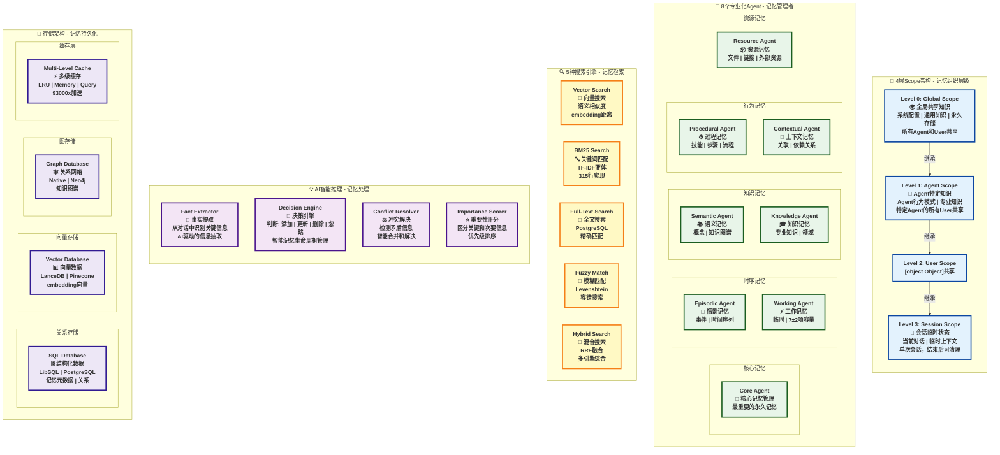

# AgentMem 完整架构图文档

**生成日期**: 2025-11-17
**版本**: v1.0
**状态**: ✅ 完整架构分析

---

## 📋 目录

1. [架构全景图 - 简洁版](#1-架构全景图---简洁版)
2. [核心数据流架构图](#2-核心数据流架构图)
3. [18个Crate模块依赖关系图](#3-18个crate模块依赖关系图)
4. [记忆系统核心概念架构图](#4-记忆系统核心概念架构图)
5. [架构总结](#5-架构总结)

---

## 1. 架构全景图 - 简洁版

展示AgentMem完整的10层架构，包含所有核心组件和模块。

```mermaid
graph TB
    subgraph "📱 应用层 Application Layer"
        direction LR
        A1["前端 UI<br/>Next.js + React<br/>3001端口"]
        A2["CLI 工具<br/>agentmem-cli<br/>命令行接口"]
        A3["Python 绑定<br/>PyO3<br/>Python SDK"]
        A4["多语言 SDK<br/>Go/JS/CJ<br/>客户端库"]
    end

    subgraph "🌐 网关层 API Gateway"
        direction LR
        G1["REST API<br/>175+ 端点<br/>8080端口"]
        G2["WebSocket<br/>实时通信<br/>双向推送"]
        G3["SSE<br/>Server-Sent Events<br/>流式响应"]
        G4["MCP 协议<br/>Model Context Protocol<br/>工具集成"]
    end

    subgraph "⚙️ 服务层 Service Layer"
        direction TB
        subgraph "核心服务"
            S1["HTTP Server<br/>agent-mem-server<br/>8K+ 行代码"]
            S2["认证授权<br/>JWT + RBAC<br/>角色权限控制"]
            S3["中间件<br/>Metrics/Audit/Quota<br/>监控审计限流"]
        end
        subgraph "业务编排"
            S4["Orchestrator<br/>智能分发<br/>任务编排"]
            S5["Coordinator<br/>Agent协调<br/>多Agent管理"]
            S6["Workflow<br/>流程引擎<br/>工作流编排"]
        end
    end

    subgraph "🧠 核心引擎层 Core Engine Layer"
        direction TB
        subgraph "记忆管理核心"
            C1["Memory Core<br/>agent-mem-core<br/>25K+ 行代码"]
            C2["Memory Manager<br/>CRUD + 分层管理<br/>4层Scope架构"]
            C3["Hierarchy Manager<br/>Global→Agent→User→Session<br/>继承与隔离"]
        end
        subgraph "8个专业化 Agent"
            direction LR
            C4["Core Agent<br/>核心记忆"]
            C5["Episodic Agent<br/>情景记忆"]
            C6["Semantic Agent<br/>语义记忆"]
            C7["Procedural Agent<br/>过程记忆"]
            C8["Working Agent<br/>工作记忆"]
            C9["Contextual Agent<br/>上下文记忆"]
            C10["Knowledge Agent<br/>知识记忆"]
            C11["Resource Agent<br/>资源记忆"]
        end
        subgraph "智能推理引擎"
            C12["Intelligence Engine<br/>agent-mem-intelligence<br/>8K+ 行代码"]
            C13["Fact Extractor<br/>事实提取<br/>AI驱动"]
            C14["Decision Engine<br/>决策引擎<br/>自动判断"]
            C15["Conflict Resolver<br/>冲突解决<br/>智能合并"]
        end
    end

    subgraph "🔍 搜索引擎层 Search Engine Layer"
        direction TB
        subgraph "5种搜索引擎"
            SE1["Vector Search<br/>向量搜索<br/>语义相似"]
            SE2["BM25 Search<br/>315行实现<br/>关键词匹配"]
            SE3["Full-Text Search<br/>PostgreSQL<br/>全文索引"]
            SE4["Fuzzy Match<br/>Levenshtein<br/>模糊匹配"]
            SE5["Hybrid Search<br/>RRF融合<br/>混合排序"]
        end
        subgraph "搜索优化"
            SE6["Adaptive Search<br/>自适应阈值<br/>动态调整"]
            SE7["Re-ranker<br/>重排序<br/>多因子评分"]
            SE8["Cached Search<br/>搜索缓存<br/>加速检索"]
        end
    end

    subgraph "🔌 插件系统层 Plugin System Layer"
        direction TB
        subgraph "WASM 插件管理"
            P1["Plugin Manager<br/>LRU缓存<br/>100插件容量"]
            P2["Plugin Loader<br/>热插拔<br/>运行时加载"]
            P3["Plugin Monitor<br/>性能监控<br/>216K calls/s"]
        end
        subgraph "插件能力系统 Capabilities"
            direction LR
            P4["Memory"]
            P5["Storage"]
            P6["Search"]
            P7["LLM"]
            P8["Network"]
            P9["Logging"]
        end
        subgraph "已实现插件"
            direction LR
            P10["hello_plugin<br/>239KB"]
            P11["memory_processor<br/>346KB"]
            P12["code_analyzer<br/>260KB"]
            P13["weather_plugin<br/>280KB"]
        end
    end

    subgraph "🤖 AI 集成层 AI Integration Layer"
        direction TB
        subgraph "LLM 提供商 20+"
            AI1["DeepSeek<br/>智能推理<br/>事实提取"]
            AI2["OpenAI<br/>GPT-4/3.5<br/>通用能力"]
            AI3["Anthropic<br/>Claude<br/>长上下文"]
            AI4["Gemini<br/>Google<br/>多模态"]
            AI5["Ollama<br/>本地模型<br/>离线运行"]
        end
        subgraph "嵌入模型"
            AI6["FastEmbed<br/>默认<br/>高性能"]
            AI7["OpenAI Embeddings<br/>ada-002<br/>高质量"]
            AI8["自定义模型<br/>可扩展<br/>灵活集成"]
        end
        subgraph "多模态处理 14模块"
            AI9["Image<br/>OpenAI Vision<br/>图像理解"]
            AI10["Audio<br/>Whisper<br/>语音转写"]
            AI11["Video<br/>帧提取<br/>视频分析"]
            AI12["Cross-Modal<br/>跨模态检索<br/>统一接口"]
        end
    end

    subgraph "💾 存储抽象层 Storage Abstraction Layer"
        direction TB
        subgraph "记忆存储"
            ST1["LibSQL<br/>默认<br/>嵌入式零配置"]
            ST2["PostgreSQL<br/>企业级<br/>ACID保证"]
            ST3["MySQL<br/>兼容<br/>广泛支持"]
        end
        subgraph "向量存储"
            ST4["LanceDB<br/>默认<br/>高性能Arrow"]
            ST5["Redis<br/>内存缓存<br/>毫秒级"]
            ST6["Pinecone<br/>云托管<br/>全托管"]
            ST7["Qdrant<br/>开源<br/>Rust实现"]
        end
        subgraph "图存储"
            ST8["Native Graph<br/>606行<br/>原生实现"]
            ST9["Neo4j<br/>企业级<br/>图数据库"]
        end
        subgraph "缓存系统"
            ST10["LRU Cache<br/>93000x加速<br/>333ns延迟"]
            ST11["Memory Cache<br/>内存缓存<br/>快速访问"]
            ST12["Query Cache<br/>查询缓存<br/>结果复用"]
        end
    end

    subgraph "🏗️ 基础设施层 Infrastructure Layer"
        direction TB
        subgraph "可观测性 Observability"
            I1["Prometheus<br/>指标收集<br/>时序数据"]
            I2["OpenTelemetry<br/>分布式追踪<br/>链路分析"]
            I3["Grafana<br/>可视化<br/>监控面板"]
            I4["Alertmanager<br/>告警<br/>通知系统"]
        end
        subgraph "性能优化 Performance"
            I5["Async I/O<br/>Tokio<br/>高并发"]
            I6["Batch Processing<br/>批量处理<br/>提升吞吐"]
            I7["Zero-Copy<br/>Arrow格式<br/>减少拷贝"]
            I8["Parallel<br/>并行计算<br/>多核利用"]
        end
        subgraph "安全性 Security"
            I9["RBAC<br/>角色权限<br/>细粒度控制"]
            I10["JWT/Session<br/>认证<br/>双模式"]
            I11["Audit Log<br/>审计日志<br/>完整追踪"]
            I12["Encryption<br/>加密<br/>TLS+存储"]
        end
        subgraph "部署运维 Deployment"
            I13["Kubernetes<br/>容器编排<br/>自动扩展"]
            I14["Docker<br/>容器化<br/>一致环境"]
            I15["Helm Charts<br/>包管理<br/>版本控制"]
            I16["Distributed<br/>分布式<br/>高可用"]
        end
    end

    subgraph "💿 数据层 Data Layer"
        direction TB
        subgraph "4层记忆架构 Memory Hierarchy"
            D1["Global Scope<br/>Level 0<br/>全局共享知识"]
            D2["Agent Scope<br/>Level 1<br/>Agent特定知识"]
            D3["User Scope<br/>Level 2<br/>用户个人信息"]
            D4["Session Scope<br/>Level 3<br/>会话临时状态"]
        end
        subgraph "记忆类型 Memory Types"
            D5["Core Memory<br/>核心记忆<br/>永久存储"]
            D6["Episodic Memory<br/>情景记忆<br/>事件序列"]
            D7["Semantic Memory<br/>语义记忆<br/>知识概念"]
            D8["Procedural Memory<br/>过程记忆<br/>技能步骤"]
            D9["Working Memory<br/>工作记忆<br/>临时缓存"]
        end
    end

    %% 样式定义
    classDef appStyle fill:#e1f5ff,stroke:#01579b,stroke-width:3px,color:#000
    classDef apiStyle fill:#f3e5f5,stroke:#4a148c,stroke-width:3px,color:#000
    classDef serviceStyle fill:#fff3e0,stroke:#e65100,stroke-width:3px,color:#000
    classDef coreStyle fill:#e8f5e9,stroke:#1b5e20,stroke-width:3px,color:#000
    classDef searchStyle fill:#fff9c4,stroke:#f57f17,stroke-width:3px,color:#000
    classDef pluginStyle fill:#fce4ec,stroke:#880e4f,stroke-width:3px,color:#000
    classDef aiStyle fill:#e0f2f1,stroke:#004d40,stroke-width:3px,color:#000
    classDef storageStyle fill:#ede7f6,stroke:#311b92,stroke-width:3px,color:#000
    classDef infraStyle fill:#fbe9e7,stroke:#bf360c,stroke-width:3px,color:#000
    classDef dataStyle fill:#e3f2fd,stroke:#0d47a1,stroke-width:3px,color:#000

    class A1,A2,A3,A4 appStyle
    class G1,G2,G3,G4 apiStyle
    class S1,S2,S3,S4,S5,S6 serviceStyle
    class C1,C2,C3,C4,C5,C6,C7,C8,C9,C10,C11,C12,C13,C14,C15 coreStyle
    class SE1,SE2,SE3,SE4,SE5,SE6,SE7,SE8 searchStyle
    class P1,P2,P3,P4,P5,P6,P7,P8,P9,P10,P11,P12,P13 pluginStyle
    class AI1,AI2,AI3,AI4,AI5,AI6,AI7,AI8,AI9,AI10,AI11,AI12 aiStyle
    class ST1,ST2,ST3,ST4,ST5,ST6,ST7,ST8,ST9,ST10,ST11,ST12 storageStyle
    class I1,I2,I3,I4,I5,I6,I7,I8,I9,I10,I11,I12,I13,I14,I15,I16 infraStyle
    class D1,D2,D3,D4,D5,D6,D7,D8,D9 dataStyle
```



---

## 2. 核心数据流架构图

展示从用户请求到数据存储的完整数据流和处理链路。

```mermaid
flowchart TD
    subgraph "用户交互层"
        USER["👤 用户应用"]
    end

    subgraph "接口层"
        API["🌐 REST API / WebSocket / MCP<br/>175+ 端点 | 8080端口"]
    end

    subgraph "认证授权层"
        AUTH["🔐 认证授权<br/>JWT + RBAC + 审计日志"]
    end

    subgraph "编排层"
        ORCH["🎯 Orchestrator 编排器<br/>智能路由 | 任务分发 | 流程控制"]
    end

    subgraph "核心处理层"
        direction TB

        subgraph "记忆管理"
            MGR["🧠 Memory Manager<br/>CRUD | 4层Scope | 冲突解决"]
            AGENTS["🤖 8个专业化 Agent<br/>Core | Episodic | Semantic | Procedural<br/>Working | Contextual | Knowledge | Resource"]
        end

        subgraph "智能推理"
            INTEL["🧠 Intelligence Engine<br/>事实提取 | 决策引擎 | 冲突解决<br/>DeepSeek驱动"]
        end

        subgraph "搜索引擎"
            SEARCH["🔍 5种搜索引擎<br/>Vector | BM25 | FullText | Fuzzy | Hybrid<br/>自适应 | 重排序 | 缓存"]
        end

        subgraph "插件系统"
            PLUGIN["🔌 WASM 插件系统<br/>热插拔 | 沙盒隔离 | LRU缓存<br/>216K calls/s"]
        end
    end

    subgraph "AI 能力层"
        direction LR
        LLM["🤖 LLM 集成<br/>20+ 提供商<br/>DeepSeek | OpenAI | Claude"]
        EMB["📊 嵌入模型<br/>FastEmbed | OpenAI<br/>向量化"]
        MULTI["🎨 多模态<br/>图像 | 音频 | 视频<br/>跨模态检索"]
    end

    subgraph "存储层"
        direction LR

        subgraph "主存储"
            DB["[object Object]LibSQL | PostgreSQL<br/>记忆数据"]
        end

        subgraph "向量存储"
            VEC["📐 向量库<br/>LanceDB | Redis<br/>Pinecone | Qdrant"]
        end


## 3. 18个Crate模块依赖关系图

详细展示18个Crate的分层结构和依赖关系。

```mermaid
graph TB
    subgraph "🎯 核心基础层 Foundation Layer"
        TRAITS["agent-mem-traits<br/>📐 核心抽象<br/>2K lines<br/>Trait定义 | 接口规范"]
        UTILS["agent-mem-utils<br/>🔧 工具库<br/>1K lines<br/>通用函数 | 辅助工具"]
        CONFIG["agent-mem-config<br/>⚙️ 配置管理<br/>1K lines<br/>环境变量 | 配置解析"]
    end

    subgraph "🧠 核心引擎层 Core Engine Layer"
        CORE["agent-mem-core<br/>💎 记忆引擎<br/>25K lines<br/>记忆管理 | 8个Agent | 搜索引擎"]
        MEM["agent-mem<br/>🎯 统一API<br/>3K lines<br/>Builder模式 | 高层封装"]
        INTEL["agent-mem-intelligence<br/>💡 智能推理<br/>8K lines<br/>事实提取 | 决策引擎 | 多模态"]
    end

    subgraph "🔌 集成层 Integration Layer"
        LLM["[object Object]+提供商 | DeepSeek | OpenAI"]
        EMB["agent-mem-embeddings<br/>📊 嵌入模型<br/>3K lines<br/>FastEmbed | 向量化"]
        STORAGE["agent-mem-storage<br/>💾 存储抽象<br/>10K lines<br/>LibSQL | PostgreSQL | 向量库"]
        TOOLS["agent-mem-tools<br/>🛠️ MCP工具<br/>5K lines<br/>工具集成 | MCP协议"]
    end

    subgraph "🌐 服务层 Service Layer"
        SERVER["agent-mem-server<br/>🌐 HTTP服务<br/>8K lines<br/>REST API | WebSocket | 175+端点"]
        CLIENT["agent-mem-client<br/>📡 客户端SDK<br/>2K lines<br/>HTTP客户端 | 类型安全"]
        COMPAT["agent-mem-compat<br/>🔄 Mem0兼容<br/>3K lines<br/>100% API兼容 | 无缝迁移"]
    end

    subgraph "🧩 扩展层 Extension Layer"
        PLUGIN_SDK["agent-mem-plugin-sdk<br/>📦 插件SDK<br/>500 lines<br/>Extism PDK | WASM接口"]
        PLUGINS["agent-mem-plugins<br/>🔌 插件管理<br/>1.5K lines<br/>热插拔 | LRU缓存 | 沙盒"]
        PYTHON["agent-mem-python<br/>🐍 Python绑定<br/>800 lines<br/>PyO3 | Python API"]
    end

    subgraph "📊 运维层 Operations Layer"
        OBS["agent-mem-observability<br/>👁️ 可观测性<br/>2K lines<br/>Prometheus | OpenTelemetry | Grafana"]
        PERF["agent-mem-performance<br/>⚡ 性能监控<br/>3K lines<br/>基准测试 |[object Object]<br/>K8s | Helm | Docker"]
        DIST["agent-mem-distributed<br/>🔗 分布式<br/>1.5K lines<br/>集群 | 高可用"]
    end

    subgraph "📈 统计信息"
        STATS["总计 18个 Crate<br/>88,000+ 行代码<br/>✅ 生产就绪<br/>✅ 模块化设计"]
    end

    %% 依赖关系
    CORE -.->|依赖| TRAITS & UTILS & CONFIG
    MEM -.->|依赖| TRAITS & UTILS & CONFIG
    INTEL -.->|依赖| TRAITS & UTILS
    LLM -.->|依赖| TRAITS & UTILS
    EMB -.->|依赖| TRAITS & CORE
    STORAGE -.->|依赖| TRAITS & UTILS & CONFIG
    TOOLS -.->|依赖| TRAITS & CORE
    MEM -.->|依赖| CORE
    INTEL -.->|依赖| CORE & LLM
    CORE -.->|依赖| STORAGE & EMB & LLM
    SERVER -.->|依赖| MEM & CORE & INTEL & STORAGE & TOOLS & PLUGINS
    CLIENT -.->|依赖| TRAITS & UTILS
    COMPAT -.->|依赖| MEM & CLIENT
    PLUGINS -.->|依赖| PLUGIN_SDK & TRAITS & CORE
    PYTHON -.->|依赖| MEM & CORE
    OBS -.->|依赖| TRAITS & UTILS
    PERF -.->|依赖| CORE & STORAGE
    DEPLOY -.->|依赖| CONFIG & SERVER
    DIST -.->|依赖| CORE & STORAGE

    %% 样式定义
    classDef foundationStyle fill:#e8f5e9,stroke:#1b5e20,stroke-width:3px,font-weight:bold
    classDef coreStyle fill:#e3f2fd,stroke:#0d47a1,stroke-width:3px,font-weight:bold
    classDef integrationStyle fill:#fff3e0,stroke:#e65100,stroke-width:3px,font-weight:bold
    classDef serviceStyle fill:#f3e5f5,stroke:#4a148c,stroke-width:3px,font-weight:bold
    classDef extensionStyle fill:#fce4ec,stroke:#880e4f,stroke-width:3px,font-weight:bold
    classDef opsStyle fill:#fbe9e7,stroke:#bf360c,stroke-width:3px,font-weight:bold
    classDef statsStyle fill:#fff9c4,stroke:#f57f17,stroke-width:4px,font-weight:bold

    class TRAITS,UTILS,CONFIG foundationStyle
    class CORE,MEM,INTEL coreStyle
    class LLM,EMB,STORAGE,TOOLS integrationStyle
    class SERVER,CLIENT,COMPAT serviceStyle
    class PLUGIN_SDK,PLUGINS,PYTHON extensionStyle
    class OBS,PERF,DEPLOY,DIST opsStyle
    class STATS statsStyle
```

---

## 4. 记忆系统核心概念架构图

深入展示记忆系统的核心概念，包括4层Scope架构、8个专业化Agent、5种搜索引擎等。



---

## 5. 架构总结

AgentMem 的架构设计体现了**模块化**、**智能化**、**高性能**和**可扩展**的核心原则。

- **分层清晰**: 从应用层到基础设施层，职责明确，易于维护和扩展。
- **智能驱动**: 以AI智能推理引擎为核心，实现记忆的自动化管理。
- **性能卓越**: 异步优先、多级缓存、零拷贝等技术保证了毫秒级响应。
- **企业就绪**: 完整的可观测性、安全性和部署工具，满足生产环境要求。

该架构为构建下一代AI智能应用提供了坚实的基础。

        subgraph "图存储"
            GRAPH["🕸️ 图数据库<br/>Native | Neo4j<br/>关系网络"]
        end

        subgraph "缓存"
            CACHE["⚡ 多级缓存<br/>LRU | Memory | Query<br/>93000x加速"]
        end
    end

    subgraph "监控层"
        direction LR
        METRICS["📊 Prometheus<br/>指标收集"]
        TRACE["🔍 OpenTelemetry<br/>分布式追踪"]
        V[object Object]<br/>可视化"]
        ALERT["🚨 Alertmanager<br/>告警"]
    end

    subgraph "数据模型层"
        direction TB

        subgraph "4层Scope架构"
            SCOPE["[object Object] Hierarchy<br/>Global → Agent → User → Session<br/>继承与隔离机制"]
        end

        subgraph "5种记忆类型"
            TYPES["🧩 Memory Types<br/>Core | Episodic | Semantic<br/>Procedural | Working"]
        end
    end

    %% 主流程
    USER -->|请求| API
    API -->|验证| AUTH
    AUTH -->|分发| ORCH

    ORCH -->|管理| MGR
    ORCH -->|推理| INTEL
    ORCH -->|搜索| SEARCH
    ORCH -->|扩展| PLUGIN

    MGR -->|调度| AGENTS

    INTEL -->|调用| LLM
    MGR -->|向量化| EMB
    INTEL -->|处理| MULTI

    MGR -->|读写| DB
    SEARCH -->|检索| VEC
    MGR -->|关系| GRAPH
    SEARCH -->|加速| CACHE

    ORCH -.->|监控| METRICS
    ORCH -.->|追踪| TRACE
    METRICS -.->|展示| VIS
    METRICS -.->|触发| ALERT

    MGR -->|组织| SCOPE
    AGENTS -->|存储| TYPES

    %% 样式
    classDef userStyle fill:#e1f5ff,stroke:#01579b,stroke-width:4px
    classDef apiStyle fill:#f3e5f5,stroke:#4a148c,stroke-width:3px
    classDef authStyle fill:#ffebee,stroke:#c62828,stroke-width:3px
    classDef orchStyle fill:#fff3e0,stroke:#e65100,stroke-width:3px
    classDef coreStyle fill:#e8f5e9,stroke:#1b5e20,stroke-width:3px
    classDef aiStyle fill:#e0f2f1,stroke:#004d40,stroke-width:3px
    classDef storageStyle fill:#ede7f6,stroke:#311b92,stroke-width:3px
    classDef monitorStyle fill:#fbe9e7,stroke:#bf360c,stroke-width:3px
    classDef dataStyle fill:#e3f2fd,stroke:#0d47a1,stroke-width:3px

    class USER userStyle
    class API apiStyle
    class AUTH authStyle
    class ORCH orchStyle
    class MGR,AGENTS,INTEL,SEARCH,PLUGIN coreStyle
    class LLM,EMB,MULTI aiStyle
    class DB,VEC,GRAPH,CACHE storageStyle
    class METRICS,TRACE,VIS,ALERT monitorStyle
    class SCOPE,TYPES dataStyle
```

---


