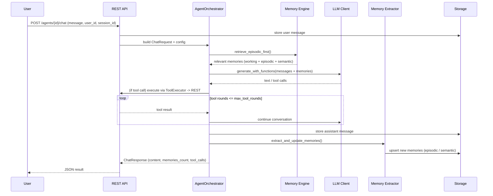
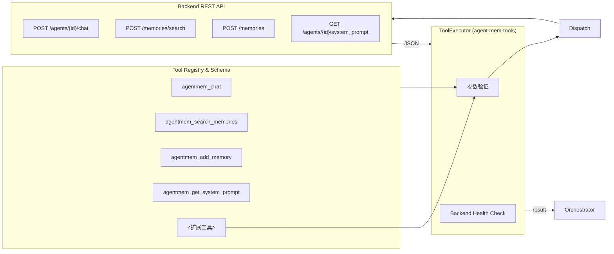
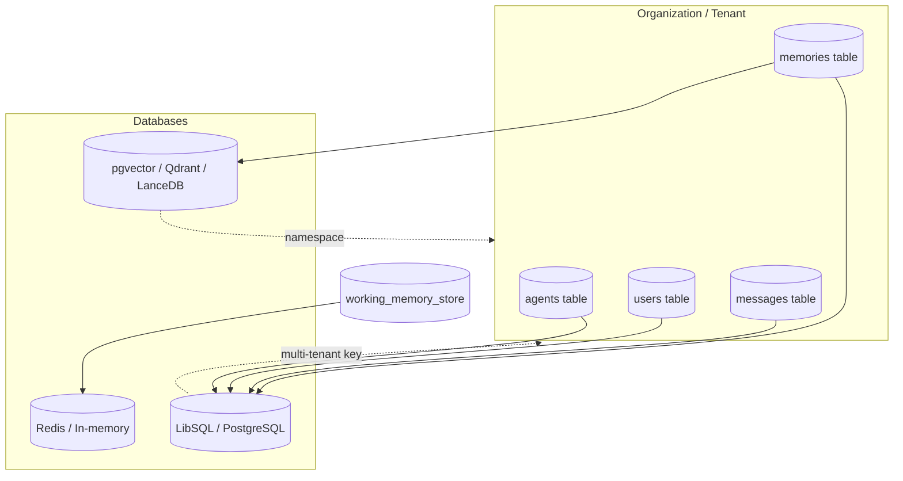

# AgentMem 技术架构（Mermaid 全景图）

> **版本**：2025-11-17  
> **范围**：覆盖 `agent-mem-core`, `agent-mem-server`, `agent-mem-tools`, `agent-mem-intelligence`, `agentmem-ui` 以及所有示例与集成层。  
> **目标**：基于完整代码分析，输出一份可视化且可追踪的技术架构文件，帮助快速理解 AgentMem 的端到端工作方式。

---

## 1. 全局分层概览

AgentMem 采用“接口层 → 编排层 → 智能层 → 存储层”的分层体系，并通过统一的配置、遥测与安全基线贯穿所有模块：

1. **接口层（Interface Layer）**  
   - REST API（`agent-mem-server` / Axum）  
   - MCP / CLI 工具（`agent-mem-tools` + `examples/mcp-stdio-server`）  
   - Web UI 管理台（`agentmem-ui` / Next.js）  
   - SDK & 示例（`crates/agent-mem-core::client`, `examples/*`）
2. **编排层（Orchestration Layer）**  
   - `AgentOrchestrator` 及其工厂（`crates/agent-mem-core` + `agent-mem-server::orchestrator_factory`）  
   - 工作记忆（Working Memory Store）与会话管理  
   - 工具调用执行器（`agent_mem_tools::ToolExecutor`）  
3. **智能层（Intelligence Layer）**  
   - 记忆引擎 & 检索策略（`memory_engine`, `memory_integration`, `hierarchical_service`）  
   - 记忆提取 / 重要性评估 / 冲突处理（`agent-mem-intelligence`）  
   - LLM 适配器（`agent-mem-llm`，支持 OpenAI、Zhipu、DeepSeek、Ollama…）  
   - 工具生态（Search、Add Memory、Chat、System Prompt 等）
4. **存储层（Storage Layer）**  
   - 结构化存储：LibSQL / PostgreSQL via `agent-mem-server::storage`  
   - 向量 / 混合索引：pgvector、LanceDB、Qdrant（通过 `agent-mem-core::engine`）  
   - 日志 & 观测：Tracing, OpenTelemetry（可选）

---

## 2. 核心模块速览

| 层级 | 关键模块 | 主要职责 | 代码位置 |
|------|----------|----------|----------|
| 接口层 | REST API | 认证、租户隔离、会话管理、JSON Schema | `crates/agent-mem-server/src/routes` |
| 接口层 | MCP 工具 | 提供 `agentmem_chat/add/search/get_system_prompt` | `crates/agent-mem-tools` |
| 接口层 | Web UI | 管理 Agent、记忆、聊天、Working Memory | `agentmem-ui/src/app` |
| 编排层 | Orchestrator | 多轮对话循环：消息入库 → 记忆检索 → LLM → 提取记忆 | `crates/agent-mem-core/src/orchestrator` |
| 编排层 | Tool Executor | 调度工具、封装 HTTP 调用 | `crates/agent-mem-tools/src/executor.rs` |
| 智能层 | Memory Engine | 混合检索、scope 推断、score 过滤 | `crates/agent-mem-core/src/engine` |
| 智能层 | Memory Intelligence | Fact extraction / importance / conflict resolver | `crates/agent-mem-intelligence` |
| 智能层 | LLM Client | Provider 抽象 + 流式输出 | `crates/agent-mem-llm` |
| 存储层 | Repositories | Agents / Memories / Messages / Users | `crates/agent-mem-server/src/storage` |
| 存储层 | Vector Stores | pgvector / Qdrant / LanceDB 驱动 | `crates/agent-mem-core/src/vector` |

---

## 3. 端到端流程（步骤说明）

1. **入口**：来自 UI/MCP/SDK 的对话请求命中 `POST /api/v1/agents/{id}/chat`。  
2. **鉴权 & 租户隔离**：`AuthUser` 中的 `org_id` 与 Agent 的 `organization_id` 校验。  
3. **Orchestrator 装配**：`create_orchestrator()` 根据 Agent 配置加载 LLM、MemoryEngine、ToolExecutor。  
4. **消息入库**：用户消息保存到 `messages` 表，生成 session-bound 工作记忆。  
5. **记忆检索**：`retrieve_episodic_first()` 先查用户 Episodic → Session Working → Agent Semantic。  
6. **Prompt 构建**：`build_messages_with_context()` 将 Working Memory + Past Memories 组合进系统提示。  
7. **LLM 调用**：`execute_with_tools()` 支持函数调用、多轮工具交互。  
8. **工具执行**：`ToolExecutor` 通过 HTTP 调用 REST API（例如 `agentmem_search_memories`）。  
9. **响应写入**：助手回复入库，Working Memory 更新，触发记忆提取（可自动抽取新事实）。  
10. **返回**：API JSON 响应包含 message_id、content、memories_count、tool_calls、processing_time。

---

## 4. Mermaid 架构图

### 4.1 分层拓扑图

```mermaid
flowchart LR
    subgraph Interface["接口层"]
        UI[agentmem-ui\nNext.js Admin]
        API[REST API\n(agent-mem-server)]
        MCP[MCP Tools\n(agent-mem-tools)]
        SDK[AgentMemClient\nSDK/Examples]
    end

    subgraph Orchestration["编排层"]
        Factory[Orchestrator Factory]
        Orchestrator[AgentOrchestrator\n(step, tool loop)]
        WM[Working Memory Store]
        Tools[ToolExecutor\n+ Tool Registry]
    end

    subgraph Intelligence["智能层"]
        Retrieval[Memory Engine /\nHierarchical Retrieval]
        Extractor[Memory Extractor /\nImportance Evaluator]
        LLM[LLM Client\n(OpenAI/Zhipu/DeepSeek/Ollama)]
        Reasoner[agent-mem-intelligence\nAdvanced Reasoners]
    end

    subgraph Storage["存储层"]
        LibSQL[(LibSQL/PostgreSQL)]
        Vector[(pgvector/Qdrant/LanceDB)]
        Cache[(Working Memory Cache)]
    end

    UI --> API
    MCP --> API
    SDK --> API

    API --> Factory --> Orchestrator
    Orchestrator --> WM
    Orchestrator --> Tools
    Orchestrator --> Retrieval
    Orchestrator --> LLM
    Orchestrator --> Extractor

    Tools --> API
    Retrieval --> Vector
    Retrieval --> LibSQL
    WM --> Cache
    Extractor --> LibSQL
    LLM -->|calls| ExternalLLM[(Providers)]
```

### 4.2 典型聊天序列



### 4.3 Working Memory & 记忆流水线

```mermaid
flowchart TB
    subgraph Session["Working Memory (session-scoped)"]
        History[对话历史\n(user+assistant)]
        Context[压缩上下文\n摘要/指令]
    end

    subgraph Extract["记忆提取流水线"]
        FE[FactExtractor\nLLM prompt]
        SF[StructuredFact Builder]
        IE[Importance Evaluator]
        CR[Conflict Resolver]
        DE[Decision Engine\n(keep/update/delete)]
    end

    subgraph Storage["持久记忆层"]
        Episodic[(episodic_memories)]
        Semantic[(semantic_memories)]
        Working[(working_memory)]
    end

    History --> Context -->|注入| Orchestrator
    Orchestrator --> FE --> SF --> IE --> CR --> DE
    DE -->|插入/更新| Episodic
    DE -->|插入/更新| Semantic
    DE -->|刷新窗口| Working
```

### 4.4 工具生态与调用链



### 4.5 存储与租户隔离



---

## 5. 设计要点与优化建议

1. **一致的 `use_memory` 管道**：从 MCP/Web UI 到 REST API、Orchestrator、Memory Engine 均可切换记忆系统，便于 A/B 测试与无记忆模式。
2. **Working Memory 隔离**：`session_id` 驱动的会话隔离确保多并发对话互不污染，同时支持自动清理策略。
3. **工具可插拔**：Tool Schema 与执行器松耦合，可向 `crates/agent-mem-tools` 添加新工具（搜索、资料、外部 API）。
4. **多存储后端**：结构化数据与向量检索解耦，可按部署环境选择 LibSQL/PostgreSQL + pgvector/Qdrant/LanceDB。
5. **LLM 多提供商**：`agent-mem-llm` 通过统一 trait 封装温度/流式/函数调用，便于切换及 fallback。
6. **智能记忆流水线**：Fact → Structured Fact → Importance → Conflict → Decision，确保记忆质量与相关性。

---

## 6. 使用建议

- **快速理解**：阅读本文件结合 `crates/agent-mem-core/src/orchestrator/mod.rs` 与 `crates/agent-mem-server/src/routes/chat.rs`，即可掌握主链路。  
- **二开扩展**：若需接入自定义工具或外部系统，可在 `agent-mem-tools` 中扩展 schema + execute，实现最小改动集成。  
- **架构沟通**：将 Mermaid 图粘贴至文档/Slides，可直接渲染出上文的拓扑与序列图，方便团队协作。

> 若需更细的子系统图（如记忆智能流水线、Working Memory 内部结构、UI 状态机），可在本文件后续章节继续补充。欢迎在 PR 中扩展更多 Mermaid 视图。


